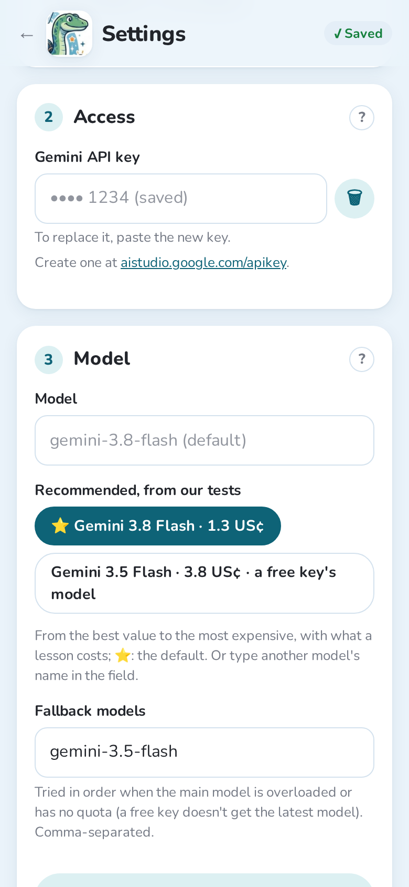
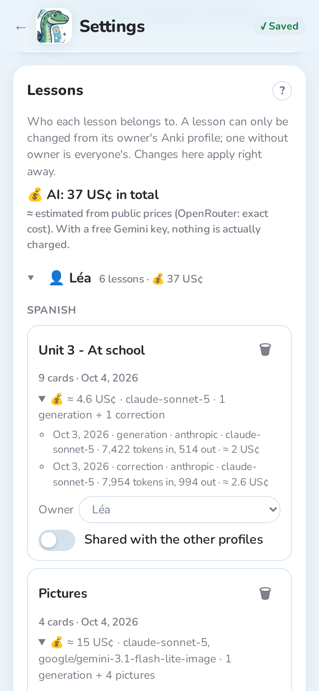

Notosaurus doesn't have its own AI: it uses the service you choose, with **your own key**. You
pay the service directly, for what you use: no subscription.

## Which service?

| Service | For whom | Cost of a lesson |
|---|---|---|
| **Gemini** (Google) | the default: fast, cheap, reads well; a free tier to try | a fraction of a cent |
| **Claude** (Anthropic) | among the best readings of handwriting, and the fastest (Sonnet) | a few cents |
| **OpenAI** (GPT) | if you already have an OpenAI account | a few cents |
| **OpenRouter** | one key for Gemini, Claude, GPT, Mistral…; the exact cost of each lesson | the price of the model chosen |
| **Other OpenAI-compatible service** | a model at home (Ollama, LM Studio), or another service | free at home |

Change service at any time in **Settings → AI service**: the lessons already made stay as they
are.

## Getting a key

Create the key on the service's site, then paste it in **Settings → Access** and tap
**🔌 Test**: Notosaurus checks that the model reads an image and answers in the right format.
The first time, the [setup assistant](../getting-started/#2-the-setup-assistant) does the same
in two steps.

### Gemini

1. Open [aistudio.google.com/apikey](https://aistudio.google.com/apikey) and sign in with a
   Google account.
2. **Create API key**, then copy it.
3. The free tier is enough to try Notosaurus, but its limits are low (a few dozen requests a
   day on the best models) and Google may use what you send to improve its products. For your
   children's notebooks, turn on billing for the key's project in Google AI Studio: you then
   pay a fraction of a cent per lesson, and, according to Google's terms, your data isn't used
   to improve its products.

### Claude

1. Open [console.anthropic.com](https://console.anthropic.com) and create an account.
2. In **Billing**, add some credit: a few euros last a long time.
3. In **Settings → API keys**, **Create key**, then copy it.

### OpenAI

1. Open [platform.openai.com](https://platform.openai.com) and create an account.
2. Add some credit in the billing settings.
3. In **API keys**, create a secret key, then copy it.

### OpenRouter

1. Open [openrouter.ai](https://openrouter.ai) and sign in.
2. Buy credits: OpenRouter adds a small fee to each purchase, so prefer one purchase of
   15 $ or more to several small ones.
3. In **Keys**, create a key, then copy it.

One OpenRouter key gives access to Gemini, Claude, GPT and many others: handy to compare them.
By default, Notosaurus uses Gemini 3.8 Flash through OpenRouter.

## The model

Under **Model**, **Recommended, from our tests** lists the models we advise for that service,
from the best value to the most expensive, with what a lesson costs. The one with a ⭐ is the
default, used when the field is empty. Tap one to choose it, or type any other model of the
service: the field suggests them. With OpenAI-compatible services, **📋 Load the service's
models** lists only the models that accept images. Gemini also has **fallback models**, tried in
order when the main one is overloaded or not included in the key's plan (a free key doesn't get
the latest model: it then uses Gemini 3.5 Flash).

## Which model?

In October 2026, we graded twelve models out of ten, like at school: eleven tests, seven of them
on real photos of a year-8 pupil's notebook (pages taken askew, phone shadows, crossed-out
words), the others without a photo (formulas, geometry figures, spelling, helps on the back).
Two AI judges compared the cards with a hand-checked reading of each page; every model ran
twice. Costs are in US cents per lesson.

| Model | Grade | On photos | Per lesson | Time | In short |
|---|---|---|---|---|---|
| **Gemini Flash** | 8.5 | 8.7 | 1.3 ¢ | 18 s | **Our advice**: nearly as good as the best for a fraction of the price, and the most consistent from one run to the next. The default with Gemini and OpenRouter. |
| **Claude Sonnet** | 8.4 | 8.8 | 3.2 ¢ | 14 s | Among the best on photos, and the fastest. The default with Claude. |
| **GPT Sol** | 8.4 | 8.5 | 2.1 ¢ | 27 s | A good deal on the OpenAI side. The default with GPT. |
| **Claude Opus** | 8.5 | 8.8 | 6.5 ¢ | 18 s | As good as Sonnet on photos, twice the price. |
| **GPT Astra** | 8.7 | 8.8 | 10.3 ¢ | 28 s | The best average, but eight times the price of Gemini Flash. |
| **Gemini Pro** | 8.0 | 8.3 | 5.3 ¢ | 27 s | Behind Gemini Flash, for four times the price. |
| **GPT Luna** | 7.8 | 7.7 | 0.1 ¢ | 23 s | Almost free, but misreads handwriting on a page taken askew. |

To avoid:

- **Kimi**, **DeepSeek Flash** and **Grok**: slow (Grok takes 2 to 3 minutes a lesson, Kimi
  ran out of time three times), or poor on pages taken askew;
- small models such as **Claude Haiku**, **GPT Mini**, **Mistral Medium** or **GLM Flash**: on
  a hard page, they **make up a lesson** instead of reading it.

Whichever the model, check the cards in the review before sending them: even the best make a
few mistakes, especially on hard-to-read handwriting. The helps on the back (explanations and
ways to remember) were the weakest test for every model.

These are the models under **Recommended, from our tests** in the settings, in their exact
tested versions (for instance `gemini-3.8-flash`, `claude-sonnet-5-5`, `gpt-6.1-sol`; on
OpenRouter `google/gemini-3.8-flash`…). Notosaurus doesn't recommend the `~…-latest` aliases:
a new version can read differently or cost more, so it is tested before it replaces one.

:::note[Limits]
One pupil and one class only. Models change often: this ranking gives a trend, not a final
verdict.
:::

## A model at home

With **Other OpenAI-compatible service**, Notosaurus can use a model running on your computer,
with [Ollama](https://ollama.com) or [LM Studio](https://lmstudio.ai). The address usually ends
with `/v1` (Ollama: `http://localhost:11434/v1`). Nothing leaves the house and nothing is
paid, but:

- the model must **accept images** (a “vision” model): **📋 Load the service's models** lists them;
- it needs a **good graphics card** (or a recent Mac with plenty of memory);
- it reads **handwriting much less reliably** than Gemini or Claude;
- with Ollama, corrections need a longer context than the default: set
  `OLLAMA_CONTEXT_LENGTH` (for instance to 16384) before starting it.

## What it costs

**Settings → Lessons** shows what the AI cost, in total, per profile and per lesson, with
each generation, correction and picture.

These figures are estimated from the services' public prices (OpenRouter gives the exact
cost). With a free Gemini key, nothing is actually charged. As an example, the vocabulary
lesson of these screenshots cost about 2 US cents to generate with Claude Sonnet, and as much
for its correction. Pictures cost from under a cent to a few cents each; figures, a fraction of
a cent.
