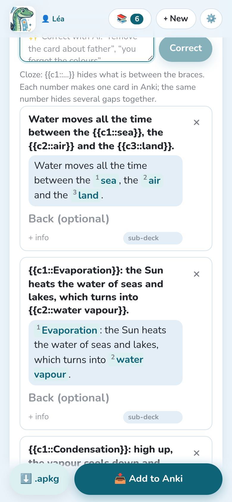
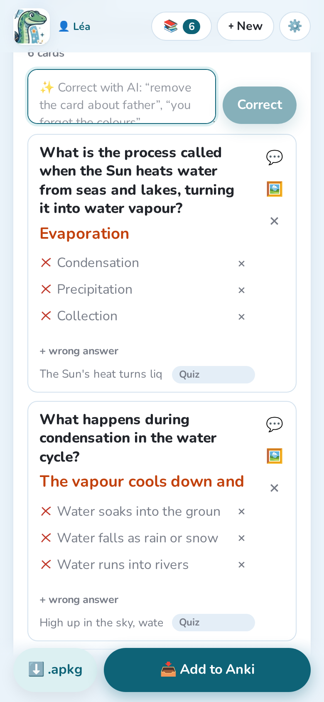
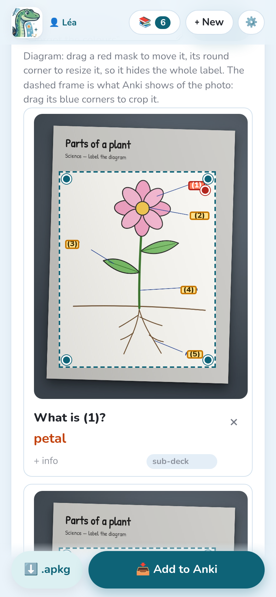
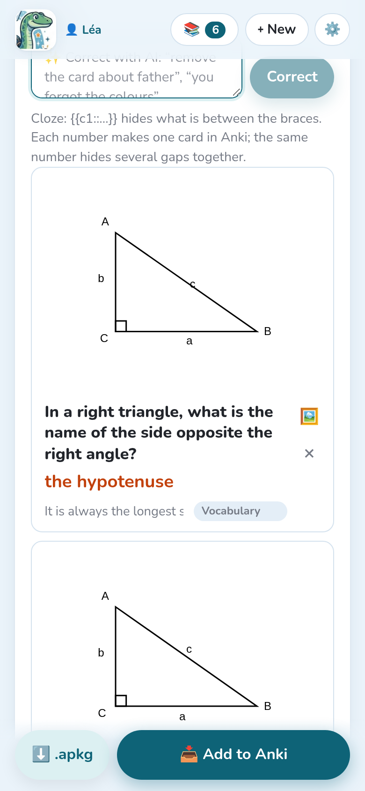
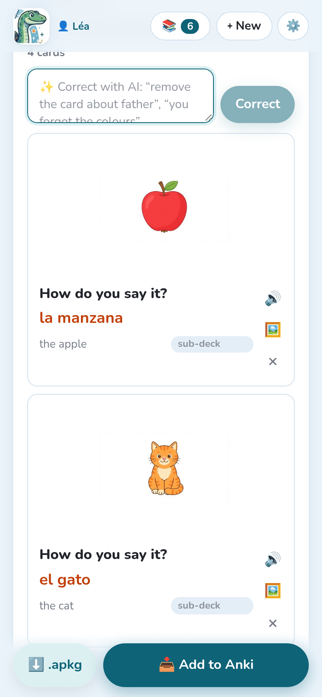

The instructions decide which kind of cards the AI makes (see [Instructions](../instructions/)).
Each kind becomes its own **note type** in Anki, whose name starts with “Notosaurus”.

## Question and answer

The classic card: a **front** (the question, a word in your language) and a **back** (the
answer, the word in the language being learnt), with an optional **info** shown under the
answer. It's what the vocabulary, sentences and questions instructions make.

Options, at the bottom of the lesson: the **reverse card** (back → front), **type the answer**
(Anki compares letter by letter) and **dictation** (hear the back, write it). See
[Reviewing the cards](../review/#card-options).

## Fill in the blanks

The **Fill in the blanks** instructions make sentences with gaps:

> The Sun heats the water of seas and lakes: this is `{{c1::evaporation}}`.

What is between `{{c1::` and `}}` is hidden. **Each number makes one card** in Anki; the same
number used twice hides two gaps together. In the review, the gaps are shown numbered: you can
change their text, add some or remove some by editing the braces.

## Multiple choice and true or false

**Multiple choice** cards have a question, the **right answer** and **wrong answers** (three
plausible ones): change them in the review, or add one with **+ wrong answer**.
**True / false** makes statements, half of them false with one precise mistake.

In Anki, the question shows the options (A, B, C…, always in the same order) and the answer
marks the right one. It's plain HTML: it looks the same on every Anki app.

## Diagrams

With the **Diagram to complete** instructions, the AI finds each label of a diagram and hides
it behind a number. Each card asks “What is (2)?” and shows the answer on the diagram.

In the review:

- drag a **red mask** to move it, and its **round corner** to resize it, so that it hides the
  whole label;
- the **dashed frame** is the part of the photo that Anki shows: drag its blue corners to crop
  it.

Gemini and GPT place the masks most precisely. With Claude, check that the masks hide the
whole label on handwriting.

## Formulas

Formulas are written in **MathJax**, which Anki displays: `\( \frac{a+b}{2} \)`,
`\( x^2 \)`. The review shows them drawn under the text. Simple calculations stay as plain
text.

## Figures

For geometry and simple labelled figures (a right triangle with its hypotenuse, a circle with
its radius, a rectangle with its measures), the AI **draws an exact figure** on the card,
instead of an image model that would draw text and measures badly. The figure never shows the
answer.

The **🖼️** button of a card opens its figure: change its description and draw it again, or
move it to the back when it belongs to the answer. The **Geometry (with figures)** instructions
make such cards, and so do **Automatic** and the formula instructions when it helps.

## Pictures

The **Vocabulary in pictures (languages)** instructions put a picture of each word on the front, drawn by an
image model: from less than a cent to a few cents per picture. Pictures are drawn by the AI
service of the cards when it can draw (Gemini, OpenAI, OpenRouter), otherwise by another one
chosen in **Settings → Pictures on cards** (Claude and local models can't draw). That section
also chooses the image model, or **No pictures**:

- **Recommended, from our tests** lists the image models we advise for the service, with what
  a picture costs; the ⭐ one is the default. We compared their drawings by eye: with OpenAI,
  GPT Image 2 (about 0.6 US cent a picture); with Gemini or OpenRouter, Gemini 3.1 Flash-Lite
  Image (about 3 US cents).
- The field also offers **every image model the service has**, new ones included: type to
  filter them.
- **🖼️ Test: draw a giraffe** draws one real picture with the chosen service and model, and
  shows it as a card would, with the time and the cost.

The **🖼️** button of a card opens its **Picture** panel:

- **What to draw (in English)**: change the description, then **🎨 Draw again** (from under a
  cent to a few US cents a drawing, depending on the model);
- **📷 My photo**: put your own photo instead, for free;
- **✕ No picture**: remove it;
- **On the back (with the answer)**: when the picture gives the answer away.
- **🔎 Find a picture**: free pictures of the subject to choose from (see below), for free.

### Free pictures, found rather than drawn

For a real thing (a person, a place, a monument, a work of art, an animal, a food), the AI
writes, with the card, a few English words to search for it ("Storming of the Bastille
painting", "dog"). Notosaurus then looks for a **free picture** before drawing one: a photo or a
painting in the public domain or under CC0 (**Wikimedia Commons**, **Openverse**; in the
Android app, **Pixabay** too), so there is nothing to credit on the cards. The cards' AI looks at
the pictures found and keeps the one that fits; when none does, the picture is drawn. It is
free (only the AI's choice costs: well under a cent) and exact: the real painting of the
storming of the Bastille, the real portrait of a president.

**Settings → Pictures on cards → Look for a free picture first** turns it off (always drawn).
In a card's panel, **🔎 Find a picture** shows the pictures found, to choose yourself: they come
filtered for pupils (no mature content), and you always see them before they go on a card.
