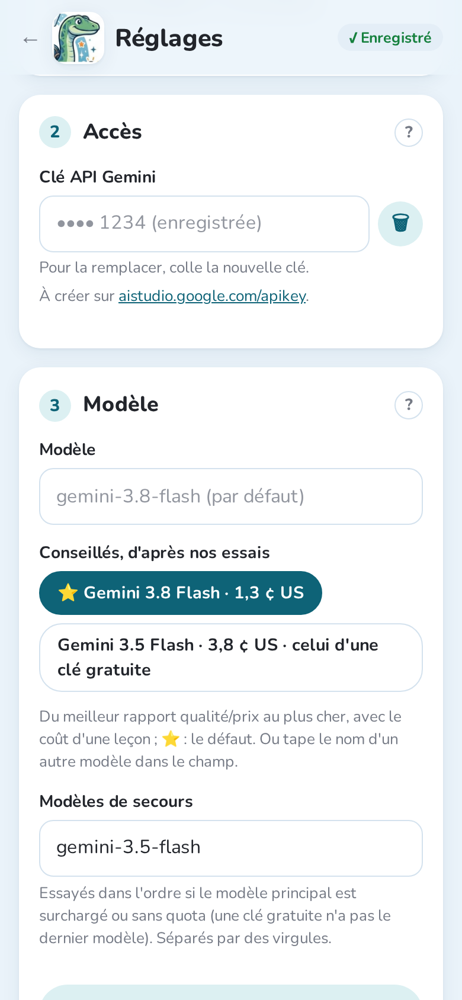
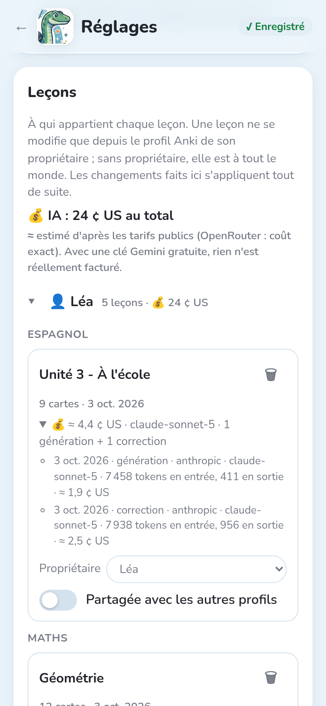

Notosaurus n'a pas sa propre IA : il utilise le service que tu choisis, avec **ta propre clé**.
Tu paies directement le service, selon ce que tu utilises : pas d'abonnement.

## Quel service ?

| Service | Pour qui | Coût d'une leçon |
|---|---|---|
| **Gemini** (Google) | le choix par défaut : rapide, peu cher, bonne lecture ; une offre gratuite pour essayer | une fraction de centime |
| **Claude** (Anthropic) | parmi les meilleures lectures de l'écriture manuscrite, et le plus rapide (Sonnet) | quelques centimes |
| **OpenAI** (GPT) | si tu as déjà un compte OpenAI | quelques centimes |
| **OpenRouter** | une seule clé pour Gemini, Claude, GPT, Mistral… ; le coût exact de chaque leçon | le prix du modèle choisi |
| **Autre service compatible OpenAI** | un modèle chez toi (Ollama, LM Studio), ou un autre service | gratuit chez toi |

Tu peux changer de service à tout moment dans **Réglages → Service d'IA** : les leçons déjà
faites restent comme elles sont.

## Obtenir une clé

Crée la clé sur le site du service, colle-la dans **Réglages → Accès** et touche
**🔌 Tester** : Notosaurus vérifie que le modèle lit une image et répond au bon format.

### Gemini

1. Ouvre [aistudio.google.com/apikey](https://aistudio.google.com/apikey) et connecte-toi avec
   un compte Google.
2. **Create API key** (créer une clé), puis copie-la.
3. L'offre gratuite suffit pour essayer Notosaurus, mais ses limites sont basses (quelques
   dizaines de requêtes par jour sur les meilleurs modèles) et Google peut utiliser ce que tu
   envoies pour améliorer ses produits. Pour les cahiers de tes enfants, active la facturation
   du projet de la clé dans Google AI Studio : tu paies alors une fraction de centime par leçon
   et, d'après les conditions de Google, tes données ne servent pas à améliorer ses produits.

### Claude

1. Ouvre [console.anthropic.com](https://console.anthropic.com) et crée un compte.
2. Dans **Billing** (facturation), ajoute un peu de crédit : quelques euros durent longtemps.
3. Dans **Settings → API keys**, **Create key**, puis copie la clé.

### OpenAI

1. Ouvre [platform.openai.com](https://platform.openai.com) et crée un compte.
2. Ajoute un peu de crédit dans les réglages de facturation.
3. Dans **API keys**, crée une clé secrète, puis copie-la.

### OpenRouter

1. Ouvre [openrouter.ai](https://openrouter.ai) et connecte-toi.
2. Achète des crédits : OpenRouter ajoute de petits frais à chaque achat, donc préfère un achat
   de 15 $ ou plus à plusieurs petits.
3. Dans **Keys**, crée une clé, puis copie-la.

Une seule clé OpenRouter donne accès à Gemini, Claude, GPT et bien d'autres : pratique pour les
comparer. Par défaut, Notosaurus utilise le dernier Gemini Flash via OpenRouter.

## Le modèle

Dans **Modèle**, laisse le champ vide pour utiliser le choix de Notosaurus pour ce service, ou
tape un autre modèle. Avec OpenAI, OpenRouter et les autres services, **📋 Charger les modèles
du service** ne liste que les modèles qui acceptent les images. Gemini a aussi des **modèles de
secours**, essayés dans l'ordre quand le modèle principal est surchargé.

## Quel modèle ?

En octobre 2026, nous avons noté douze modèles sur dix, comme en classe : onze épreuves, dont
sept sur de vraies photos du cahier d'un élève de 5ᵉ (pages prises de travers, ombre du
téléphone, mots barrés), les autres sans photo (formules, figures de géométrie, dictée, aides
au verso). Deux IA jurées ont comparé les cartes à une lecture de chaque page vérifiée à la
main ; chaque modèle est passé deux fois. Les coûts sont en centimes de dollar par leçon.

| Modèle | Note | Sur photos | Par leçon | Durée | En bref |
|---|---|---|---|---|---|
| **Gemini Flash** | 8,5 | 8,7 | 1,3 ¢ | 18 s | **Notre conseil** : presque au niveau des meilleurs pour une fraction du prix, et le plus régulier d'un passage à l'autre. Le choix par défaut de Notosaurus. |
| **Claude Sonnet** | 8,4 | 8,8 | 3,2 ¢ | 14 s | Parmi les meilleurs sur les photos, et le plus rapide. |
| **GPT Sol** | 8,4 | 8,5 | 2,1 ¢ | 27 s | Une bonne affaire du côté d'OpenAI. |
| **Claude Opus** | 8,5 | 8,8 | 6,5 ¢ | 18 s | Aussi bon que Sonnet sur les photos, pour deux fois le prix. |
| **GPT Astra** | 8,7 | 8,8 | 10,3 ¢ | 28 s | La meilleure moyenne, mais huit fois le prix de Gemini Flash. |
| **Gemini Pro** | 8,0 | 8,3 | 5,3 ¢ | 27 s | Derrière Gemini Flash, pour quatre fois le prix. |
| **GPT Luna** | 7,8 | 7,7 | 0,1 ¢ | 23 s | Presque gratuit, mais lit mal l'écriture manuscrite sur une page de travers. |

À éviter :

- **Kimi**, **DeepSeek Flash** et **Grok** : lents (Grok met 2 à 3 minutes par leçon, Kimi a
  dépassé le délai trois fois), ou faibles sur les pages de travers ;
- les petits modèles comme **Claude Haiku**, **GPT Mini**, **Mistral Medium** ou **GLM
  Flash** : devant une page difficile, ils **inventent une leçon** au lieu de la lire.

Quel que soit le modèle, vérifie les cartes dans la relecture avant de les envoyer : même les
meilleurs font quelques erreurs, surtout sur une écriture difficile à lire. Les aides au verso
(explications et astuces pour retenir) ont été l'épreuve la plus faible pour tous les modèles.

Avec **OpenRouter**, tape le modèle dans **Modèle**, par exemple `~google/gemini-flash-latest`,
`~anthropic/claude-sonnet-latest` ou `~openai/gpt-sol-latest` (`latest` prend toujours la
version la plus récente). Avec Claude ou OpenAI directement, le champ **Modèle** les propose :
`claude-sonnet-5`, `claude-opus-5`, `gpt-6-sol`, `gpt-6-astra`…

:::note[Les limites]
Un seul élève et une seule classe. Les modèles changent souvent (les `latest` encore plus) : ce
classement donne une tendance, pas un verdict définitif.
:::

## Un modèle chez toi

Avec **Autre service compatible OpenAI**, Notosaurus peut utiliser un modèle qui tourne sur ton
ordinateur, avec [Ollama](https://ollama.com) ou [LM Studio](https://lmstudio.ai). L'adresse se
termine en général par `/v1` (Ollama : `http://localhost:11434/v1`). Rien ne sort de la maison
et rien n'est payé, mais :

- le modèle doit **accepter les images** (un modèle « vision ») : **📋 Charger les modèles du
  service** les liste ;
- il faut une **bonne carte graphique** (ou un Mac récent avec beaucoup de mémoire) ;
- il lit **beaucoup moins bien l'écriture manuscrite** que Gemini ou Claude ;
- avec Ollama, les corrections ont besoin d'un contexte plus long que celui par défaut : règle
  `OLLAMA_CONTEXT_LENGTH` (par exemple à 16384) avant de le lancer.

## Ce que ça coûte

**Réglages → Leçons** affiche ce qu'a coûté l'IA, au total, par profil et par leçon, avec
chaque génération, correction et image.

Ces montants sont estimés d'après les tarifs publics des services (OpenRouter donne le coût
exact). Avec une clé Gemini gratuite, rien n'est réellement facturé. Par exemple, la leçon de
vocabulaire de ces captures a coûté environ 2 centimes de dollar à générer avec Claude Sonnet,
et autant pour sa correction. Les images coûtent de moins d'un centime à quelques centimes
chacune ; les figures, une fraction de centime.
