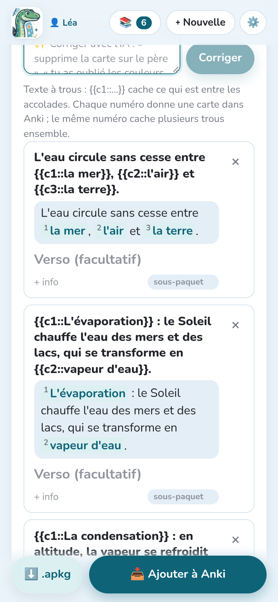
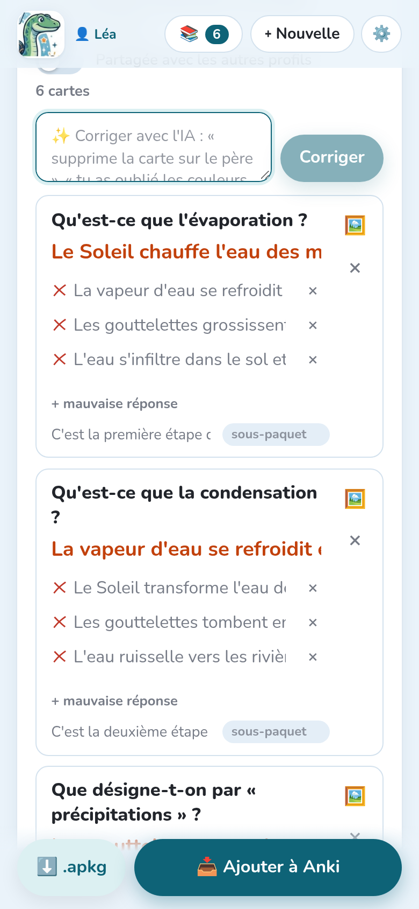
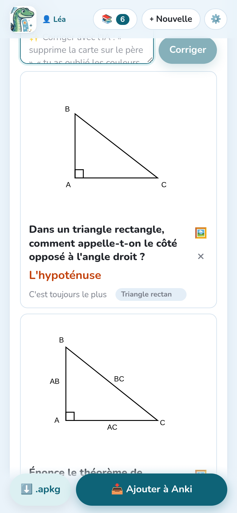
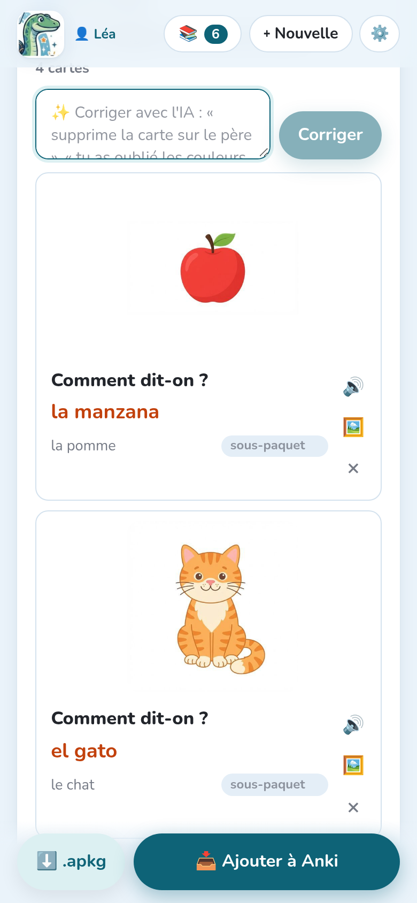

La consigne décide du type de cartes que fait l'IA (voir [Les consignes](../instructions/)).
Chaque type devient son propre **type de note** dans Anki, dont le nom commence par
« Notosaurus ».

## Question et réponse

La carte classique : un **recto** (la question, un mot dans ta langue) et un **verso** (la
réponse, le mot dans la langue étudiée), avec une **info** facultative affichée sous la
réponse. C'est ce que font les consignes de vocabulaire, de phrases et de questions.

Options, en bas de la leçon : la **carte inverse** (verso → recto), **taper la réponse**
(Anki compare lettre par lettre) et la **dictée** (entendre le verso, l'écrire). Voir
[Relire les cartes](../review/#les-options-des-cartes).

## Texte à trous

La consigne **Texte à trous** fait des phrases à trous :

> Le Soleil chauffe l'eau des mers et des lacs : c'est `{{c1::l'évaporation}}`.

Ce qui est entre `{{c1::` et `}}` est caché. **Chaque numéro donne une carte** dans Anki ; le
même numéro utilisé deux fois cache deux trous ensemble. Dans la relecture, les trous
s'affichent numérotés : tu peux changer leur texte, en ajouter ou en retirer en modifiant les
accolades.

## QCM et vrai ou faux

Les cartes de **QCM** ont une question, la **bonne réponse** et des **mauvaises réponses**
(trois, plausibles) : modifie-les dans la relecture, ou ajoutes-en avec **+ mauvaise
réponse**. **Vrai / faux** fait des affirmations, dont la moitié fausses avec une seule erreur
précise.

Dans Anki, la question affiche les choix (A, B, C…, toujours dans le même ordre) et la réponse
marque le bon. C'est du HTML simple : le rendu est le même sur toutes les applis Anki.

## Schémas

Avec la consigne **Schéma à compléter**, l'IA trouve chaque légende d'un schéma et la cache
derrière un numéro. Chaque carte demande « Qu'est-ce que (2) ? » et montre la réponse sur le
schéma.

Dans la relecture :

- fais glisser un **masque rouge** pour le déplacer, et son **coin rond** pour l'agrandir,
  afin qu'il cache toute la légende ;
- le **cadre en pointillés** est la partie de la photo qu'Anki affiche : fais glisser ses
  coins bleus pour la recadrer.

Gemini et GPT placent les masques le plus précisément. Avec Claude, vérifie que les masques
cachent toute la légende sur une écriture manuscrite.

## Formules

Les formules sont écrites en **MathJax**, qu'Anki affiche : `\( \frac{a+b}{2} \)`, `\( x^2 \)`.
La relecture les affiche dessinées sous le texte. Les calculs simples restent en texte.

## Figures

Pour la géométrie et les figures simples avec des légendes (un triangle rectangle et son
hypoténuse, un cercle et son rayon, un rectangle et ses mesures), l'IA **dessine une figure
exacte** sur la carte, au lieu d'un modèle d'images qui dessinerait mal le texte et les
mesures. La figure ne montre jamais la réponse.

Le bouton **🖼️** d'une carte ouvre sa figure : modifie sa description et redessine-la, ou
déplace-la au verso quand elle fait partie de la réponse. La consigne **Géométrie (avec
figures)** fait ce type de cartes, tout comme **Automatique** et les consignes de formules
quand c'est utile.

## Images

La consigne **Mots en images** met au recto une image de chaque mot, dessinée par un modèle
d'images : de moins d'un centime à quelques centimes par image. Les images sont dessinées par
le service d'IA des cartes quand il sait dessiner (Gemini, OpenAI, OpenRouter), sinon par un
autre choisi dans **Réglages → Images des cartes** (Claude et les modèles locaux ne dessinent
pas). Cette section choisit aussi le modèle d'images, ou **Pas d'images**.

Le bouton **🖼️** d'une carte ouvre son panneau **Image** :

- **Ce qu'il faut dessiner (en anglais)** : change la description, puis **🎨 Refaire**
  (environ 3 à 7 centimes de dollar par dessin) ;
- **📷 Ma photo** : mets ta propre photo à la place, gratuitement ;
- **✕ Pas d'image** : retire-la ;
- **Au verso (avec la réponse)** : quand l'image donne la réponse.
