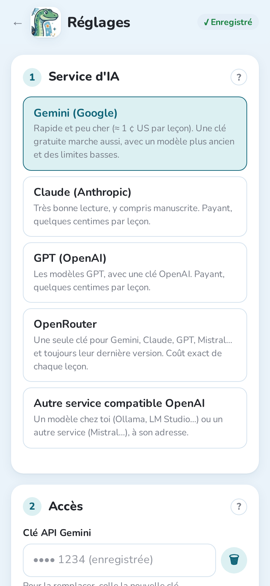
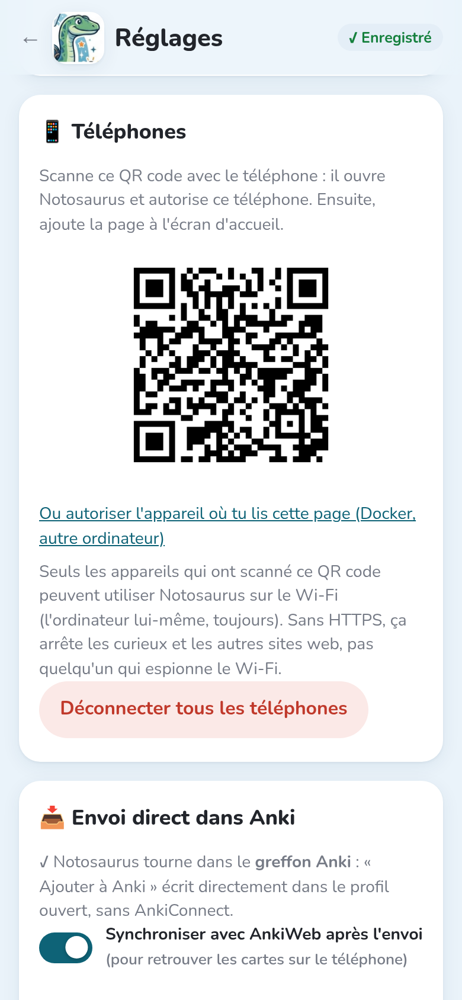

Notosaurus est un greffon pour Anki sur ordinateur. Il tourne sur ton ordinateur, et tu
l'utilises depuis le navigateur de ton téléphone, sur le même Wi-Fi.

## Ce qu'il te faut

- **Anki** sur un ordinateur (Windows, macOS ou Linux), dans une version récente.
- **Un téléphone** sur le même Wi-Fi que l'ordinateur.
- **Une clé pour un service d'IA.** Gemini est le moins cher et a une offre gratuite pour
  essayer Notosaurus ; Claude lit le mieux l'écriture manuscrite. Une leçon coûte d'une
  fraction de centime à quelques centimes.

:::caution[Offres gratuites et confidentialité]
Les offres gratuites autorisent en général le fournisseur d'IA à utiliser ce que tu envoies
pour améliorer ses modèles. Pour les cahiers de tes enfants, préfère une clé payante :
quelques euros durent longtemps.
:::

## 1. Installer le greffon

1. Télécharge `notosaurus-<version>.ankiaddon` depuis la
   [dernière version](https://github.com/cchabanois/notosaurus/releases/latest).
2. Double-clique sur le fichier (ou dans Anki : **Outils → Greffons → Installer depuis un
   fichier**), puis redémarre Anki.
3. Au premier démarrage, Notosaurus demande avant d'installer ses composants (environ
   300 Mo). Ça prend quelques minutes, une seule fois.

## 2. Ajouter ta clé d'IA

Dans Anki, ouvre **Outils → Notosaurus → Réglages**, choisis le **service d'IA**, colle ta
clé et clique sur **Tester**. Les réglages ne s'ouvrent que sur l'ordinateur : les enfants
ne peuvent pas les changer depuis un téléphone.

## 3. Ouvrir Notosaurus sur le téléphone

Dans Anki, choisis **Outils → Notosaurus → Ouvrir sur le téléphone…** et scanne le QR code
avec l'appareil photo du téléphone. Ajoute ensuite la page à l'écran d'accueil : elle
s'ouvre comme une appli.

:::tip
Seuls les appareils qui ont scanné ce QR code peuvent utiliser Notosaurus. Si un téléphone
est perdu ou prêté : **Réglages → Téléphones → Déconnecter tous les téléphones**.
:::

## 4. Ta première leçon

1. Dans **Photos de la leçon**, prends la page en photo (ou plusieurs pages) : voir
   [Bien prendre la photo](../photos/).
2. Dans **Consigne**, choisis ce qu'il faut faire : vocabulaire, questions, texte à trous,
   schéma à compléter… **Automatique** choisit d'après la leçon. Voir [Les consignes](../instructions/).

   

3. Touche **Générer les cartes** et attends quelques secondes.
4. Vérifie les cartes. Modifie-les, supprimes-en, ou demande à l'IA de les corriger avec
   tes mots : voir [Relire les cartes](../review/).

   

   

5. Touche **Ajouter à Anki**.

La leçon est enregistrée : tu peux la rouvrir plus tard depuis la liste des leçons, la
corriger et la renvoyer. Ses cartes sont mises à jour dans Anki, pas dupliquées.

Avec la consigne **Schéma à compléter**, les légendes d'un schéma sont cachées derrière des
numéros : chaque carte en demande une.

## 5. Réviser sur le téléphone

Pour réviser sur le téléphone, utilise **AnkiDroid** (Android) ou **AnkiMobile** (iPhone)
avec un compte **AnkiWeb** : Notosaurus synchronise Anki après l'envoi des cartes. Avec
plusieurs enfants, consulte [Plusieurs enfants](../several-children/).
