Avec le greffon, Notosaurus tourne dans Anki sur l'ordinateur : il démarre avec Anki, s'arrête
avec lui, et écrit les cartes directement dans le profil ouvert.

## Le menu Outils → Notosaurus

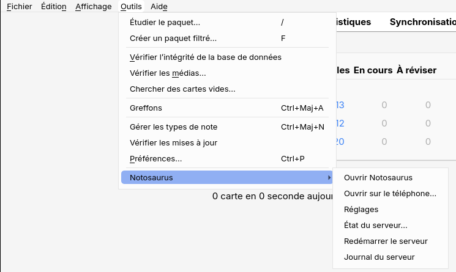

- **Ouvrir Notosaurus** ouvre Notosaurus dans le navigateur de l'ordinateur.
- **Ouvrir sur le téléphone…** affiche un QR code pour ouvrir Notosaurus sur le téléphone, et
  les trois étapes pour y arriver (voir [Sur le téléphone](../phone/)). Il s'affiche tout seul
  une fois, la première fois.
- **Réglages** ouvre les réglages (service d'IA et clé, voix, enfants…) dans le navigateur de
  l'ordinateur. Ils ne s'ouvrent que sur l'ordinateur : le téléphone ne peut pas les changer.
- **État du serveur…** dit si Notosaurus est en marche, ses adresses (sur le téléphone et sur
  cet ordinateur), et où sont ses fichiers et tes leçons.
- **Redémarrer le serveur** arrête et relance Notosaurus : après avoir changé la configuration
  du greffon, ou quand quelque chose est bloqué.
- **Journal du serveur** montre ce que Notosaurus a fait dernièrement. C'est la première chose à
  regarder quand quelque chose ne va pas (voir la [FAQ](../faq/)).
- **Aide** ouvre cette documentation, dans la langue d'Anki.

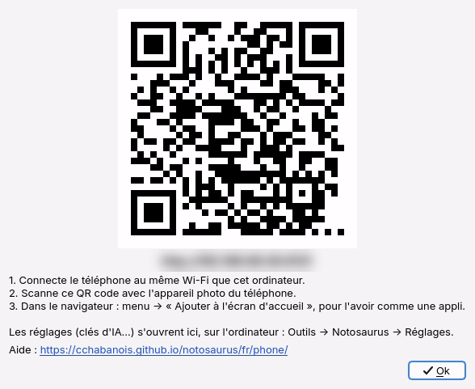

Changer de profil dans Anki laisse Notosaurus en marche : les cartes vont alors dans le profil
ouvert (voir [Plusieurs enfants](../several-children/)).

## La configuration du greffon

Quelques options techniques sont dans **Outils → Greffons**, sélectionne **Notosaurus**, puis
**Configuration** :

- `autostart` : démarrer Notosaurus avec Anki (`true` par défaut). Avec `false`, il démarre la
  première fois que tu utilises le menu.
- `host` : `0.0.0.0` (par défaut) permet au téléphone d'atteindre Notosaurus sur le même
  Wi-Fi ; `127.0.0.1` le réserve à cet ordinateur.
- `port` : `8000` par défaut. Change-le si un autre programme utilise déjà ce port.
- `source`, `python`, `data` : laisse-les vides. Ils ne servent qu'à développer Notosaurus.

Après un changement : **Outils → Notosaurus → Redémarrer le serveur**.

## Les paquets

Chaque leçon a son paquet, par exemple `Espagnol::Unité 3 - À l'école` : `::` met un paquet
dans un autre, les leçons d'une matière sont donc regroupées. Les cartes qui ont une section
(Vocabulaire, QCM…) vont dans un sous-paquet du paquet de la leçon.

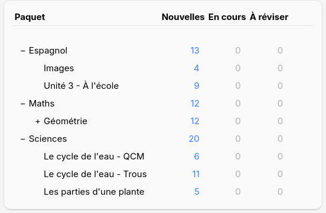

Pour réviser toute une matière, clique sur son paquet : Anki prend les cartes de tous les
paquets qu'il contient.

## Les cartes dans Anki

Voici à quoi ressemblent les [types de cartes](../card-types/) pendant une révision dans Anki
sur l'ordinateur. AnkiDroid et AnkiMobile affichent les mêmes cartes.

**Question et réponse** : un mot avec son audio (▶) et une précision.

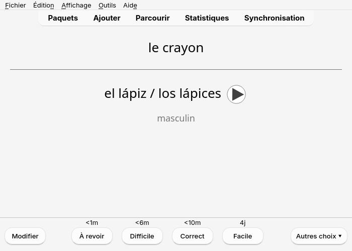

**Texte à trous** : la question cache le mot, la réponse le montre.

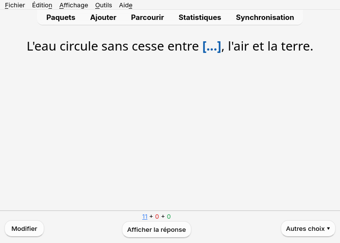

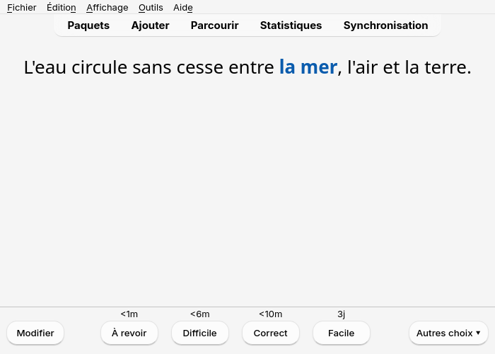

**QCM** : la réponse marque le bon choix d'un ✔ et donne l'explication.

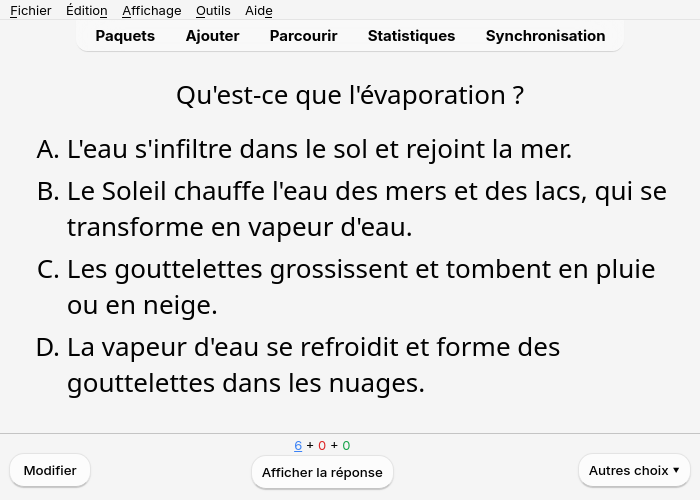

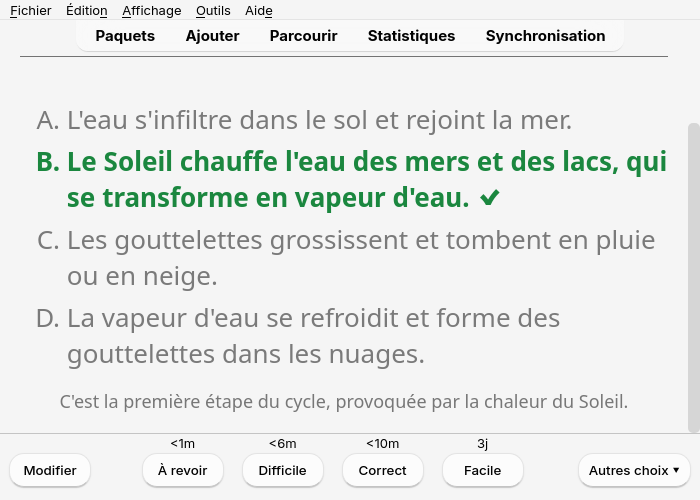

**Schémas** : la photo de la leçon avec des étiquettes numérotées ; une carte par étiquette à
nommer.

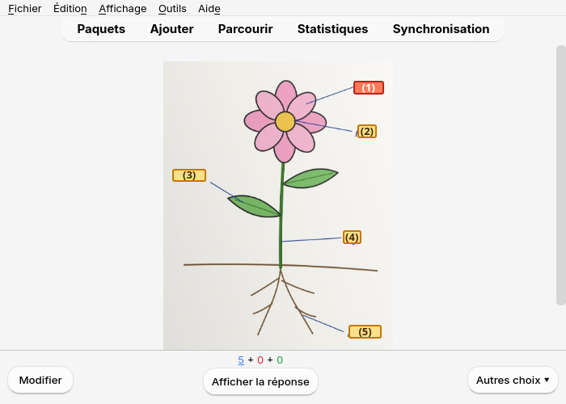

**Images** : un dessin à nommer dans la langue apprise, avec son audio.

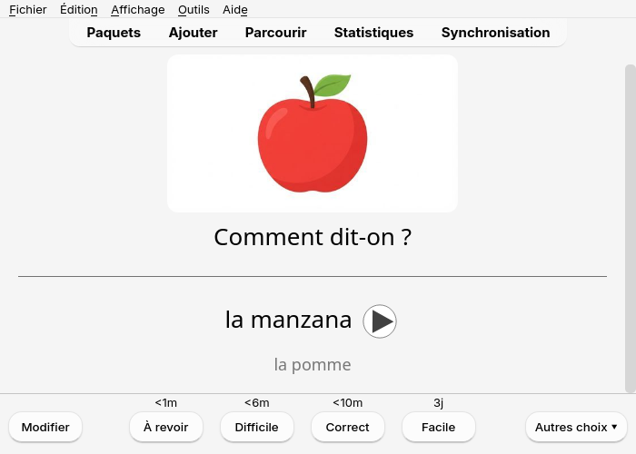

**Figures** : la figure dessinée par Notosaurus accompagne la question.

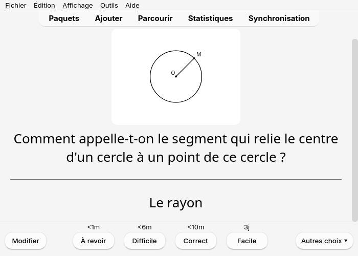
