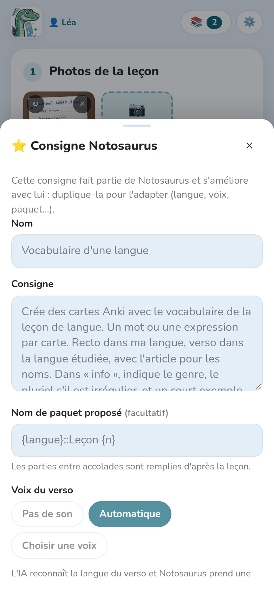

La **consigne** dit à l'IA quoi faire de la leçon : quelles cartes, dans quel sens, dans
quelles langues. La photo dit *quoi* apprendre ; la consigne dit *comment*.

## Choisir une consigne

Dans **Consigne**, les plus récentes s'affichent en boutons. **Toutes** ouvre la liste
complète, avec une recherche.

Le texte de la consigne choisie s'affiche sous les boutons. Tu peux le modifier **pour cette
fois seulement** (« Modifiée pour cette fois seulement »), par exemple pour ajouter
« seulement les verbes » : ta modification reste avec la leçon, la consigne enregistrée ne
change pas.

## Les consignes de Notosaurus

Les consignes marquées ⭐ sont fournies par Notosaurus et s'améliorent à chaque version.
Elles ne se modifient pas, mais se **dupliquent** pour en faire ta propre version.

| Consigne | Ce qu'elle fait |
|---|---|
| Automatique (d'après la leçon) | L'IA regarde la leçon et choisit les cartes les plus utiles. |
| Vocabulaire d'une langue | Une carte par mot ou expression, avec l'article, le genre et le pluriel dans l'info. |
| Phrases d'une langue | Une carte par phrase, dans ta langue et dans la langue étudiée. |
| Questions / réponses | Des questions courtes sur le contenu : dates, définitions, idées clés. |
| Texte à trous | Des phrases à trous : une carte par numéro de trou. |
| QCM | Une question, la bonne réponse et trois mauvaises plausibles. |
| Vrai / faux | Des affirmations, dont la moitié fausses avec une seule erreur précise. |
| Formules (maths, physique…) | Une carte par formule, avec ce que représente chaque lettre. |
| Formules de maths du collège | Les principales formules du collège, sans photo. |
| Géométrie (avec figures) | Figures, propriétés et vocabulaire, avec une figure exacte dessinée sur les cartes. |
| Schéma à compléter | Les légendes d'un schéma cachées derrière des numéros : une carte par légende. |
| Mots en images | L'image de chaque mot au recto, dessinée par un modèle d'images ; le mot au verso. |
| Liste de mots (sans photo) | Une carte par mot de la liste ajoutée à la fin de la consigne (français → espagnol : duplique-la pour une autre langue). |
| Dictée de mots | Une carte par mot à savoir écrire : une phrase où il manque le mot au recto, le mot au verso, une astuce d'orthographe. |

## Tes propres consignes

**Nouvelle** crée une consigne que tu réutiliseras, par exemple pour la langue que ton
enfant apprend chaque semaine. **Dupliquer** part d'une consigne de Notosaurus.

- **Nom** : ce qu'affiche le bouton.
- **Consigne** : ce que l'IA doit faire, avec tes mots (« une carte par date, au recto
  l'événement, au verso la date »).
- **Nom de paquet proposé** : le paquet Anki, avec `::` pour les sous-paquets. Les parties
  entre accolades sont remplies d'après la leçon : `Espagnol::Leçon {n}` devient
  `Espagnol::Leçon 5`.
- **Voix du verso** : pas de son, **Automatique** (l'IA reconnaît la langue des versos et
  Notosaurus prend une voix de cette langue), ou une voix que tu choisis et que tu peux
  écouter.
- **Options des cartes** : taper la réponse, ajouter une dictée (voir
  [Relire les cartes](../review/)).

**✏️ Libre** écrit une consigne pour cette fois seulement : elle reste avec la leçon, mais
n'est pas ajoutée à ta liste. **Enregistrer comme nouvelle consigne** la garde si elle a
bien marché.

## Les « Le savais-tu ? »

L'interrupteur **💡 Ajouter des « Le savais-tu ? »**, sous la consigne, demande à l'IA
d'ajouter une anecdote courte et connue à certaines cartes. Elle s'affiche au verso dans
Anki. Il est désactivé par défaut et mémorisé sur chaque appareil.

## Les instructions permanentes

Certaines instructions valent pour toutes les leçons : « espagnol d'Espagne », « en 5ᵉ ;
réponses courtes ». Écris-les une fois dans **Réglages → Instructions pour l'IA**, pour tous
les profils ou pour chaque enfant : voir
[Plusieurs enfants](../several-children/#des-instructions-pour-chaque-enfant).
