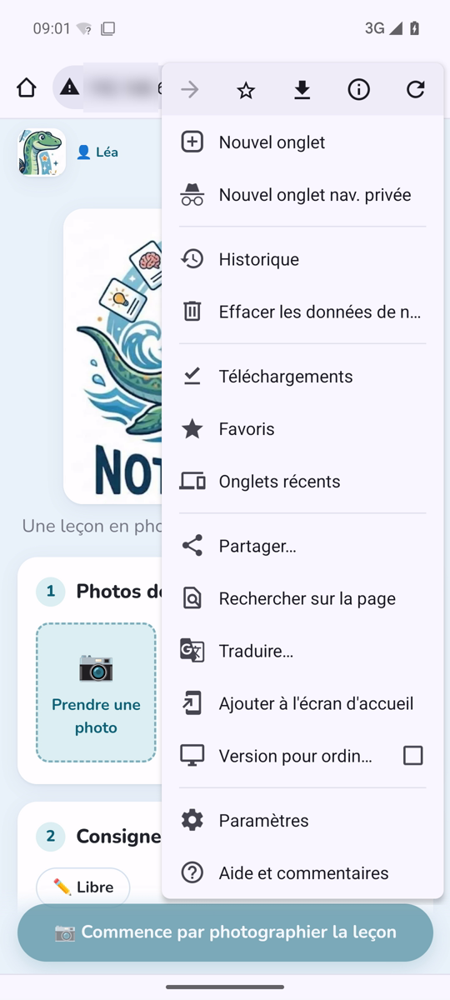
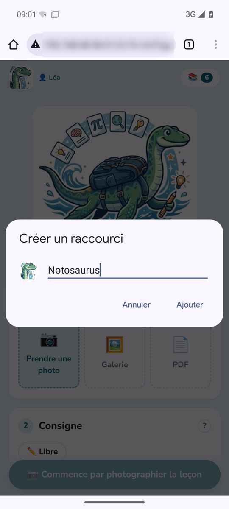
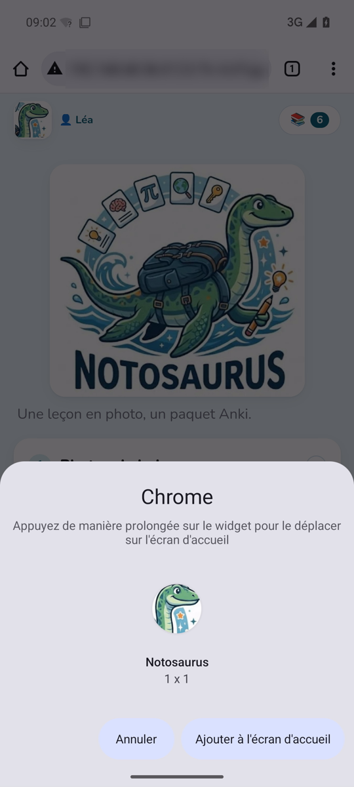
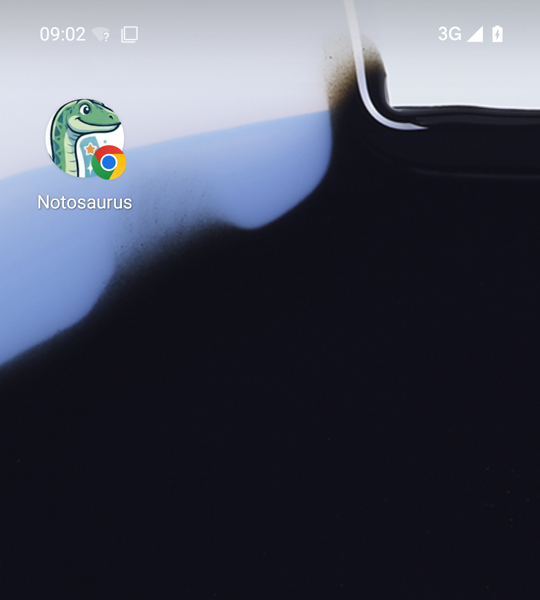

Notosaurus est une page web, pas une appli d'un magasin d'applications : le téléphone l'ouvre dans
son navigateur. Ajoutée à l'écran d'accueil, elle s'ouvre ensuite d'un geste, comme une appli.

## 1. Ouvrir Notosaurus

Dans Anki sur l'ordinateur, **Outils → Notosaurus → Ouvrir sur le téléphone…** affiche un QR code.
Avec le téléphone sur le **même Wi-Fi** que l'ordinateur, scanne-le avec l'appareil photo du
téléphone et ouvre le lien.

Scanner le QR code **autorise aussi ce téléphone** à utiliser Notosaurus : les autres appareils du
Wi-Fi ne le peuvent pas (voir
[Confidentialité et sécurité](../privacy/#qui-peut-utiliser-notosaurus-)).

## 2. L'ajouter à l'écran d'accueil

Fais-le **juste après avoir scanné le QR code**, depuis la page qui s'est ouverte : l'icône garde
l'autorisation du téléphone.

### Android

Dans **Chrome** :

1. Le menu **⋮**, en haut à droite → **Ajouter à l'écran d'accueil**.

   

2. **Créer un raccourci** : garde le nom **Notosaurus**, puis **Ajouter**.

   

3. **Ajouter à l'écran d'accueil** (ou appuie longuement sur l'icône pour la placer toi-même).

   

4. L'icône **Notosaurus** est sur l'écran d'accueil, parfois sur la page suivante.

   

Dans les autres navigateurs :

- **Samsung Internet** : le menu **≡** → **Ajouter la page à** → **Écran d'accueil**.
- **Firefox** : le menu **⋮** → **Ajouter à l'écran d'accueil** (ou **Installer**).

### iPhone et iPad

Dans **Safari** : le bouton **Partager** (le carré avec une flèche) → **Sur l'écran d'accueil** →
**Ajouter**. Sur un iPhone, l'icône ne partage pas la mémoire de Safari : c'est en l'ajoutant juste
après avoir scanné le QR code qu'elle est autorisée.

## Bon à savoir

- **Le téléphone doit être sur le même Wi-Fi** que l'ordinateur, et Anki doit être ouvert sur
  l'ordinateur (avec le greffon) : Notosaurus fonctionne à la maison, pas à l'extérieur.
- **Si tous les téléphones ont été déconnectés** (Réglages → Téléphones) ou si l'adresse de
  l'ordinateur a changé (après un redémarrage de la box), l'icône n'ouvre plus Notosaurus : scanne à
  nouveau le QR code, puis ajoute de nouveau la page à l'écran d'accueil (et supprime l'ancienne
  icône).
