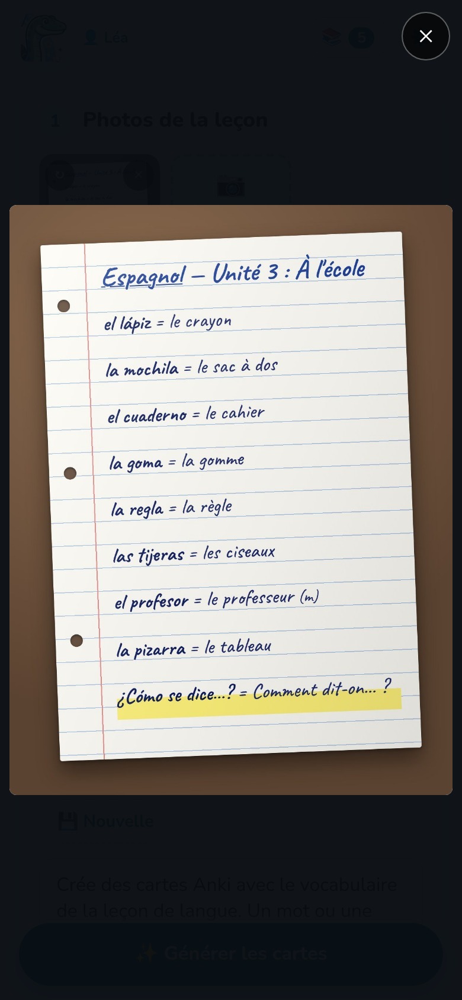

L'IA lit ce qu'elle voit : une photo nette donne de meilleures cartes, et moins de
corrections.

## Conseils

- **Bonne lumière, pas d'ombre.** La lumière du jour près d'une fenêtre est idéale. Évite
  l'ombre du téléphone et de ta main sur la page.
- **La page à plat, qui remplit la photo.** Tiens le téléphone au-dessus de la page,
  parallèle à elle. Un léger angle passe ; un angle fort rend flou le bas de la page.
- **Une page par photo.** Pour une double page, prends deux photos.
- **Nette.** Touche l'écran pour faire la mise au point avant de prendre la photo, et ne
  bouge pas.
- **Seulement la leçon.** Laisse hors du cadre les autres pages, les dessins dans la marge
  et les corrections qui ne sont pas à apprendre, ou dis à l'IA quoi ignorer dans la
  consigne.

L'écriture manuscrite est bien lue quand un adulte peut la lire. Claude la lit le mieux ;
Gemini est un bon choix, moins cher.

## Plusieurs pages

Une leçon peut avoir **jusqu'à 10 pages**. Après la première photo, **Page suivante** en
ajoute une autre ; **Galerie** choisit des photos déjà prises (JPEG, PNG, WebP ou GIF).

**📄 PDF** ajoute les pages d'un PDF, par exemple une fiche envoyée par l'enseignant : chaque
page devient une photo. S'il y a plus de pages que la leçon n'a de place, Notosaurus les
affiche toutes et tu choisis lesquelles ajouter. Chaque page envoyée coûte comme une photo. Un
PDF protégé par un mot de passe doit d'abord être enregistré sans son mot de passe.

Sur chaque photo :

- **↻** la tourne d'un quart de tour ;
- **×** la retire ;
- un toucher l'affiche en plein écran : glisse pour passer d'une page à l'autre, touche à
  nouveau pour la voir en taille réelle.

Pas besoin de redresser toi-même une photo prise de travers : Notosaurus trouve le sens de
chaque page en la lisant, et l'enregistre à l'endroit.

## Que deviennent les photos ?

- Les photos sont envoyées au **service d'IA choisi dans les réglages**, pour être lues, et à
  personne d'autre.
- Elles sont **enregistrées avec la leçon** sur ton ordinateur, pour pouvoir la rouvrir, la
  corriger ou la régénérer plus tard. Supprimer la leçon les supprime.
- Les cartes de schéma gardent une **copie recadrée** du schéma, avec ses légendes
  masquées : c'est ce qu'Anki affiche.

## Pas de photo ?

Sans photo, **Générer à partir de la consigne seule** crée les cartes à partir de la
consigne : mets-y les mots (« les 20 verbes irréguliers : be, have, go… »), ou demande un
sujet (« les planètes du système solaire »). Vérifie bien ces cartes : elles ne viennent pas
de ta leçon.
