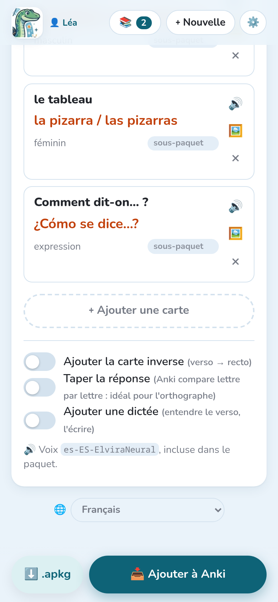

Même la meilleure IA lit parfois un mot de travers : **parcours toujours les cartes** avant
de les envoyer. Tout ce que tu modifies est enregistré au fur et à mesure (« ✓ Enregistrée »).

## Le paquet et les cartes

- **Paquet** : le nom du paquet Anki. `::` crée des sous-paquets :
  `Espagnol::Unité 3 - À l'école`.
- Chaque carte a un **recto** (la question) et un **verso** (la réponse). Touche un texte
  pour le modifier.
- **+ info** ajoute une note affichée sous la réponse : genre, pluriel, un exemple…
- **sous-paquet** range la carte dans un sous-paquet de la leçon (« Vocabulaire »,
  « Verbes »).
- **🔊** fait écouter le verso avec la voix de la leçon.
- **×** supprime la carte ; **＋ Ajouter une carte**, en bas, en ajoute une.

**📝 Consigne utilisée pour cette leçon**, au-dessus des cartes, rappelle ce qui a été
demandé à l'IA.

## Corriger avec l'IA

Plutôt que de modifier les cartes une par une, demande avec tes mots, dans le champ
au-dessus des cartes :

- « supprime la carte sur le père »
- « tu as oublié les couleurs en bas de la page »
- « ajoute le pluriel au verso, comme : la regla / las reglas »
- « des questions plus courtes »

Touche **Corriger**. L'IA revoit les photos et ne change que ce que tu as demandé : les
cartes changées sont marquées **modifiée**, les nouvelles **nouvelle**, et une phrase
résume ce qu'elle a fait. **↩ Annuler** remet les cartes comme avant.

## Régénérer

**✨ Régénérer**, sous la consigne, refait les cartes de la leçon ouverte, par exemple avec
une autre consigne ou après avoir ajouté une page. Les cartes sont remplacées ;
**↩ Annuler** les remet, sauf si les photos ont changé. Si la leçon a déjà été envoyée à
Anki, les cartes envoyées y restent, et les nouvelles sont ajoutées au prochain envoi.

## Les options des cartes

En bas de la leçon :

- **Ajouter la carte inverse** : Anki demande aussi verso → recto.
- **Taper la réponse** : Anki compare ce qui est tapé lettre par lettre. Idéal pour
  l'orthographe.
- **Ajouter une dictée** : une carte où l'on entend le verso, puis on l'écrit. Il faut une
  voix.

La ligne en dessous indique la voix qui lit les versos. Elle est incluse dans le paquet :
elle fonctionne partout, même hors connexion.

## La leçon d'un autre profil

Une leçon partagée par le profil d'un autre enfant s'ouvre **en lecture seule** : tu peux
quand même l'ajouter à ton Anki, mais seul son propriétaire peut la modifier. Voir
[Plusieurs enfants](../several-children/).
