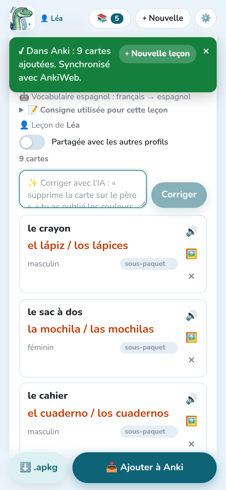

Une fois les cartes vérifiées, elles partent dans Anki d'un geste, ou sous forme de fichier.

## Ajouter à Anki

**📥 Ajouter à Anki** écrit les cartes directement dans le **profil ouvert dans Anki**, dans
le paquet de la leçon, avec leur audio et leurs images. Un message dit ce qui a été fait, par
exemple « ✓ Dans Anki : 9 cartes ajoutées. Synchronisé avec AnkiWeb. »

- Avec le **greffon**, Notosaurus écrit dans Anki lui-même : rien d'autre à installer.
- Notosaurus **autonome** (sans le greffon) a besoin d'Anki ouvert sur l'ordinateur, avec le
  greffon [AnkiConnect](https://ankiweb.net/shared/info/2055492159).
- Si la leçon appartient à un autre enfant que le profil ouvert dans Anki, Notosaurus demande
  avant de l'écrire dans la mauvaise collection (voir [Plusieurs enfants](../several-children/)).

## Renvoyer une leçon

Tu peux corriger une leçon et la renvoyer autant de fois que tu veux : ses cartes sont **mises
à jour** dans Anki, **pas dupliquées**, et l'historique de révision de chaque carte est
gardé. Les cartes ajoutées depuis le dernier envoi sont ajoutées ; les cartes supprimées de la
leçon restent dans Anki (supprime-les là-bas si tu veux). Supprimer une leçon entière dans
Notosaurus propose de supprimer aussi ses cartes dans Anki, avec leur historique de révision.

Changer une option des cartes (carte inverse, taper la réponse…) sur une leçon déjà envoyée
fait passer ses cartes au type de note correspondant, historique gardé.

Dans Anki, les notes de chaque leçon portent l'étiquette `notosaurus::<leçon>` : pratique pour
les retrouver dans le navigateur.

## Le fichier .apkg

**⬇️ .apkg** télécharge le paquet sous forme de fichier, avec son audio et ses images, sans
qu'Anki ait besoin d'être ouvert :

- **sur un ordinateur**, double-clique dessus : Anki l'importe ;
- **sur Android**, ouvre le fichier téléchargé et choisis **AnkiDroid**. Si AnkiDroid n'est pas
  proposé, partage le fichier vers AnkiDroid, ou utilise **Importer** dans le menu
  d'AnkiDroid ;
- **sur iPhone**, ouvre-le avec **AnkiMobile** depuis le menu de partage.

Importer un `.apkg` plus récent de la même leçon met aussi ses cartes à jour au lieu de les
dupliquer.

Avec le **greffon Notosaurus**, une leçon envoyée par **📥 Ajouter à Anki** et son `.apkg`
donnent les mêmes cartes : tu peux mélanger les deux, sur l'ordinateur et sur le téléphone. Avec
**AnkiConnect**, choisis une seule méthode par profil Anki : un `.apkg` importé là où la leçon a
déjà été envoyée directement (ou dans un profil synchronisé avec lui) ajouterait chaque carte une
deuxième fois.

## Faire arriver les cartes sur le téléphone

Après **Ajouter à Anki**, Notosaurus **synchronise le profil avec AnkiWeb** (l'option
**Synchroniser avec AnkiWeb après l'envoi**, dans les réglages). Les cartes arrivent ensuite
dans AnkiDroid ou AnkiMobile à leur prochaine synchronisation. Si le profil n'est pas connecté
à AnkiWeb, les cartes sont ajoutées à Anki sur l'ordinateur, et le message indique qu'il n'y a
pas eu de synchronisation.

Sans compte AnkiWeb, le fichier `.apkg` ouvert sur le téléphone met le paquet directement dans
AnkiDroid, mais les révisions restent alors sur ce téléphone seulement.
