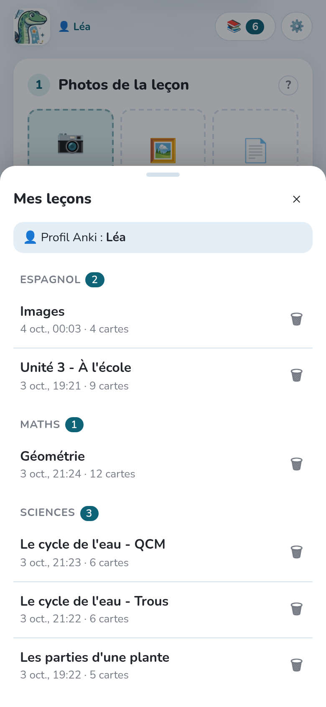
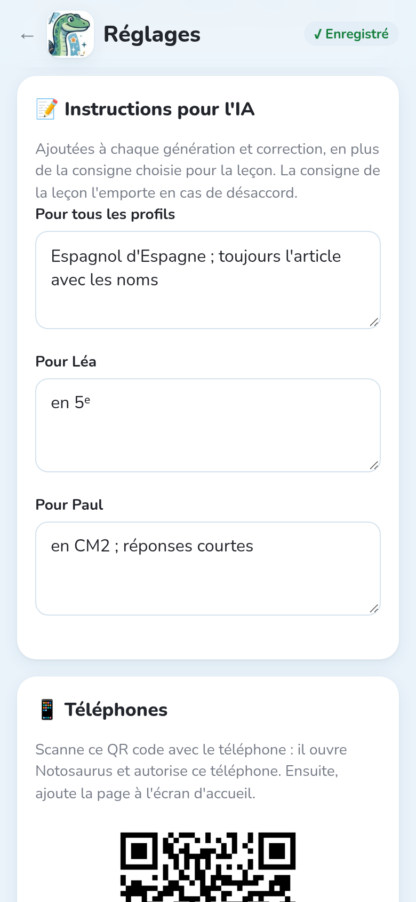

Chaque enfant a son propre **profil Anki** : ses cartes, sa progression. Notosaurus suit le
profil ouvert dans Anki.

## Un profil par enfant

1. Dans Anki, **Fichier → Changer de profil → Ajouter**, et crée un profil par enfant
   (Léa, Paul…).
2. Pour chaque profil, crée un **compte AnkiWeb** et connecte-le dans ce profil
   (**Outils → Préférences → Synchronisation**). Un compte AnkiWeb contient une seule
   collection : chaque enfant a besoin du sien.
3. Sur le téléphone de chaque enfant, connecte **AnkiDroid** ou **AnkiMobile** au compte
   AnkiWeb de cet enfant.

:::tip[Pas besoin d'une boîte mail par enfant]
Beaucoup de messageries acceptent les alias avec un `+` : `parent+lea@exemple.fr` et
`parent+paul@exemple.fr` arrivent dans ta propre boîte, mais comptent comme deux adresses.
:::

## Les leçons appartiennent à un profil

- Une leçon appartient au profil **ouvert dans Anki au moment où elle est créée**. La liste
  des leçons montre celles de ce profil.
- Pour faire une leçon pour Paul, **ouvre d'abord le profil de Paul dans Anki**, puis prends
  la photo.
- Si tu envoies une leçon alors que le profil d'un autre enfant est ouvert, Notosaurus te
  prévient avant de l'écrire dans la mauvaise collection.
- Une leçon peut être **partagée avec les autres profils** (l'interrupteur dans la
  relecture), par exemple quand deux enfants ont la même leçon.

## Des instructions pour chaque enfant

Dans **Réglages → Instructions pour l'IA**, tu peux ajouter des instructions pour tous les
profils (« espagnol d'Espagne ») et pour chaque enfant (« en 5ᵉ ; réponses courtes »). Elles
s'ajoutent à chaque leçon de cet enfant.

## Faire arriver les cartes sur le téléphone

Après **Ajouter à Anki**, Notosaurus synchronise le profil ouvert avec AnkiWeb. Les cartes
arrivent sur le téléphone de l'enfant à sa prochaine synchronisation.
