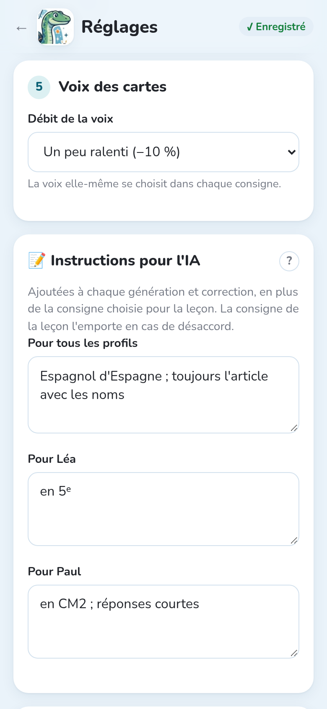

Notosaurus peut lire à voix haute le verso de chaque carte : pratique pour les langues, pour
entendre la bonne prononciation. L'audio est **inclus dans le paquet** : il fonctionne partout
dans Anki, sur l'ordinateur et le téléphone, même hors connexion.

## Choisir la voix

La voix fait partie de la **consigne** (voir [Les consignes](../instructions/)) : ouvre-la avec
**✏️ Modifier la consigne**, ou **Duplique** une consigne de Notosaurus, puis choisis dans **Voix
du verso** :

- **Pas de son** : les versos ne sont pas lus.
- **Automatique** : l'IA reconnaît la langue des versos, et Notosaurus prend une voix de cette
  langue (espagnol → Elvira, anglais britannique → Sonia…). Le plus simple.
- **Choisir une voix** : tape le début de la langue (`fr-FR`, `es-ES`, `en-GB`…) pour voir ses
  voix, féminines ou masculines, et **▶** pour en écouter une.

Les consignes de vocabulaire de Notosaurus utilisent **Automatique**. En bas d'une leçon, une
ligne indique la voix qui lit ses versos.

## Écouter

Dans la relecture, **🔊** sur une carte fait écouter son verso avec la voix de la leçon : vérifie
la prononciation avant d'envoyer les cartes.

## Débit

**Réglages → Voix des cartes → Débit de la voix** : **Normal**, **Un peu ralenti (−10 %)** (par
défaut) ou **Lent (−25 %)**, pratique pour les débutants. Le débit s'applique à l'audio fait
ensuite.

## Dictée

Avec une voix, l'option **Ajouter une dictée** (en bas de la leçon, ou dans la consigne) ajoute
une carte où l'on entend le verso, puis on l'écrit. Voir
[Relire les cartes](../review/#les-options-des-cartes).

## Des cartes sans son

Les voix viennent du service de synthèse vocale de Microsoft : faire l'audio demande Internet. S'il
ne répond pas, les cartes sont envoyées sans son et le message dit combien. Renvoie la leçon plus
tard : l'audio manquant est ajouté. Voir [Confidentialité et sécurité](../privacy/) pour ce qui est
envoyé.
