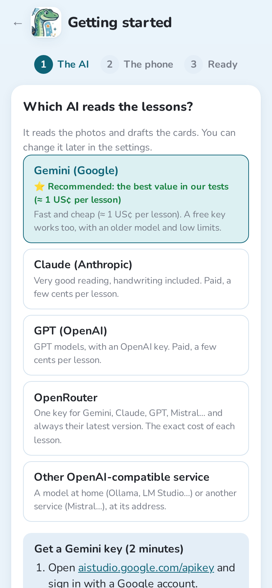
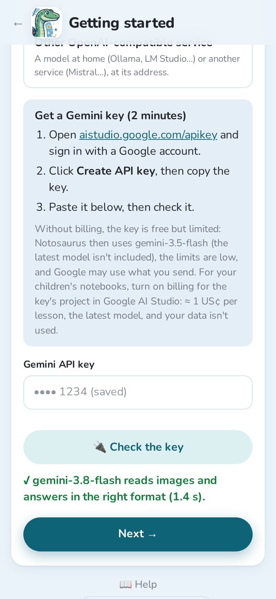
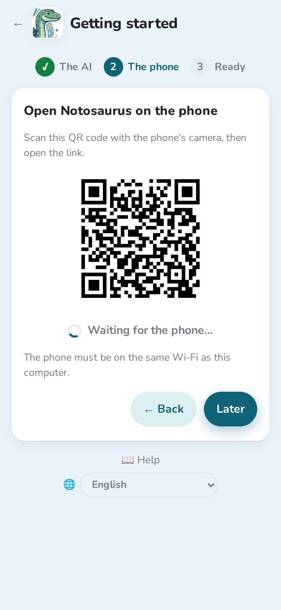
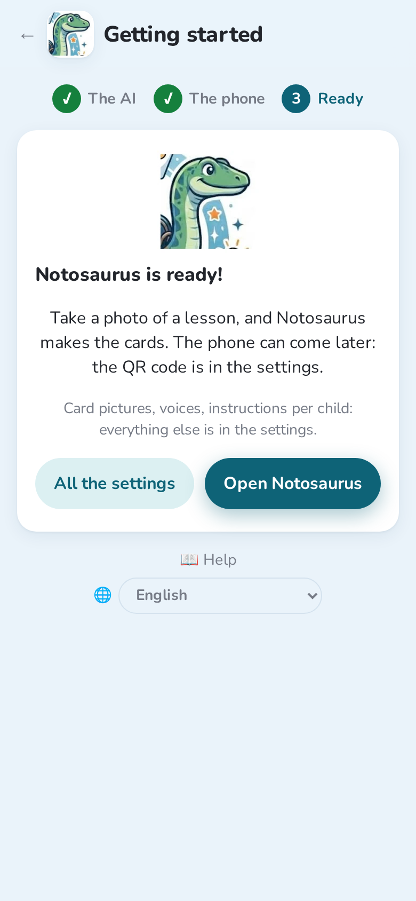

Notosaurus is an add-on for Anki desktop. It runs on your computer, and you use it from
your phone's browser, on the same Wi-Fi.

## What you need

- **Anki** on a computer (Windows, macOS or Linux), a recent version.
- **A phone** on the same Wi-Fi as the computer.
- **A key for an AI service.** Gemini is the cheapest and has a free tier to try
  Notosaurus; Claude and GPT work well too. A lesson costs from a fraction of a cent to a
  few cents.

:::caution[Free tiers and privacy]
Free tiers usually let the AI provider use what you send to improve their models. For your
children's notebooks, prefer a paid key: a few euros last a long time.
:::

## 1. Install the add-on

1. Download `notosaurus-<version>.ankiaddon` from the
   [latest release](https://github.com/cchabanois/notosaurus/releases/latest).
2. Double-click the file (or in Anki: **Tools → Add-ons → Install from file**), then
   restart Anki.
3. On first start, Notosaurus asks before installing its components (about 300 MB). It
   takes a few minutes, once.

## 2. The setup assistant

Once the components are installed, Anki offers **“Set it up now?”**: the assistant opens in
the computer's browser. Two steps, a few minutes. It is always in **Tools → Notosaurus →
Getting started**, and as long as no AI is set up, the Notosaurus page shows **“One step
left”** with a button to start it.

**The AI.** Choose the service that reads the lessons. **Gemini** is recommended: the best
value in our tests, about 1 US cent per lesson (see [AI services and costs](../ai-services/)
for the others).

For Gemini, the assistant explains how to get the key in three steps. Paste it, then tap
**🔌 Check the key**: Notosaurus checks that the model reads an image and answers in the right
format. **Next** shows up once it passes.

**The phone.** Scan the QR code with the phone's camera and open the link. The assistant
waits for the phone, then shows **“✓ The phone is connected”**. Then add the page to the home
screen: it opens like an app (see [On the phone](../phone/) for each browser). **Later** skips
this step: the QR code stays in **Tools → Notosaurus → Open on the phone…** and in the
settings.

**Ready!** Open Notosaurus, or all the settings: card pictures, voices, instructions per
child… Settings only open on the computer: children can't change them from a phone.

:::tip
Only devices that scanned this QR code can use Notosaurus. If a phone is lost or lent,
**Settings → Phones → Disconnect every phone**.
:::

## 3. Your first lesson

1. Under **Lesson photos**, take a photo of the page (or several pages), or add a PDF: see
   [Photos and PDFs](../photos/).
2. Under **Instructions**, pick what to make: vocabulary, questions, fill in the blanks, a
   diagram to complete… **Automatic** chooses from the lesson. See [Instructions](../instructions/).

   

3. Tap **Generate cards** and wait a few seconds.
4. Check the cards. Edit them, delete some, or ask the AI to fix them in plain words: see
   [Reviewing the cards](../review/).

   

   

5. Tap **Add to Anki**.

The lesson is saved: you can reopen it later from the list of lessons, correct it and send it
again. Its cards are updated in Anki, not duplicated.

With the **Diagram or map to complete** instructions, the labels of a diagram are hidden behind
numbers: each card asks for one of them.

## 4. Review on the phone

To review on the phone, use **AnkiDroid** (Android) or **AnkiMobile** (iPhone) with an
**AnkiWeb** account: Notosaurus syncs Anki after sending the cards. With several children,
see [Several children](../several-children/).
