With the add-on, Notosaurus runs inside Anki desktop: it starts with Anki, stops with it, and
writes the cards straight into the profile that is open.

## The Tools → Notosaurus menu

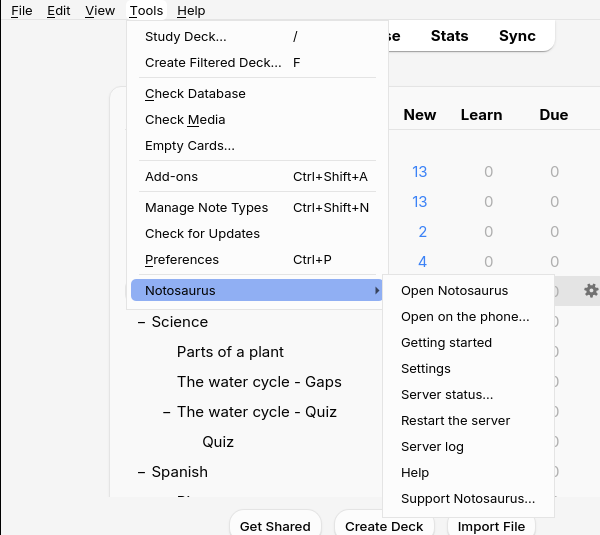

- **Open Notosaurus** opens Notosaurus in the computer's browser.
- **Open on the phone…** shows a QR code to open Notosaurus on the phone, and the three steps
  to get there (see [On the phone](../phone/)). It is shown once by itself, the first time.
- **Settings** opens the settings (AI service and key, voices, children…) in the computer's
  browser. They only open on the computer: the phone can't change them.
- **Server status…** says whether Notosaurus is running, its addresses (on the phone and on
  this computer), and where its files and your lessons are.
- **Restart the server** stops and starts Notosaurus again: after changing the add-on's
  configuration, or when something is stuck.
- **Server log** shows what Notosaurus did lately. It is the first thing to look at when
  something goes wrong (see the [FAQ](../faq/)).
- **Help** opens this documentation, in Anki's language.

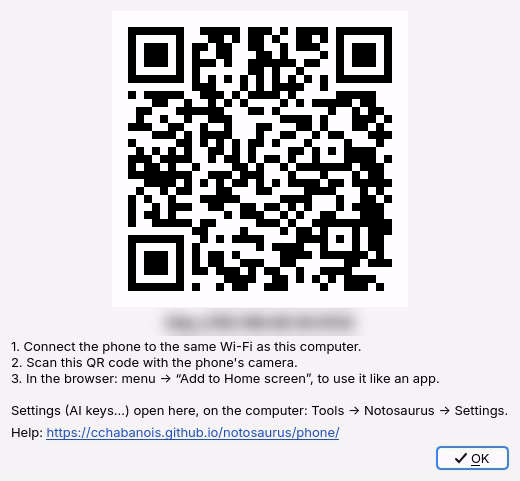

Switching profiles in Anki keeps Notosaurus running: the cards then go into the profile that is
open (see [Several children](../several-children/)).

## The add-on's configuration

A few technical options are in **Tools → Add-ons**, select **Notosaurus**, then **Config**:

- `autostart`: start Notosaurus with Anki (`true` by default). With `false`, it starts the
  first time you use the menu.
- `host`: `0.0.0.0` (by default) lets the phone reach Notosaurus on the same Wi-Fi;
  `127.0.0.1` keeps it to this computer only.
- `port`: `8000` by default. Change it if another program already uses that port.
- `source`, `python`, `data`: leave them empty. They are only for developing Notosaurus.

After a change: **Tools → Notosaurus → Restart the server**.

## The decks

Each lesson has its deck, for instance `Spanish::Unit 3 - At school`: `::` makes a deck inside
another one, so the lessons of a subject are grouped together. Cards with a section (Vocabulary,
Quiz…) go into a sub-deck of the lesson's deck.

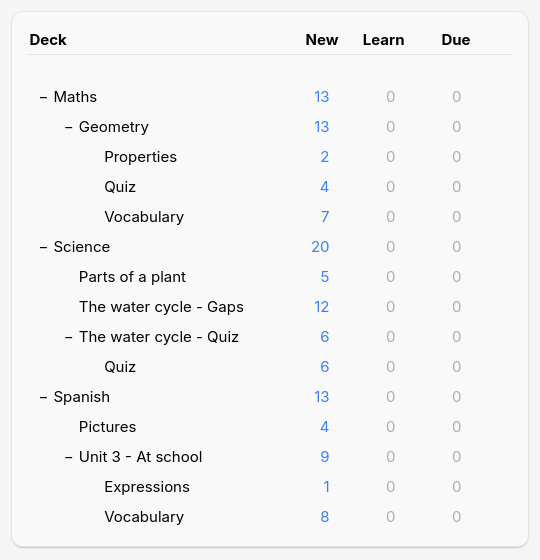

To review a whole subject, click its deck: Anki takes the cards of all the decks inside it.

## The cards in Anki

Here is what the [card types](../card-types/) look like during a review in Anki desktop.
AnkiDroid and AnkiMobile show the same cards.

**Question and answer**: a word with its audio (▶) and a note.

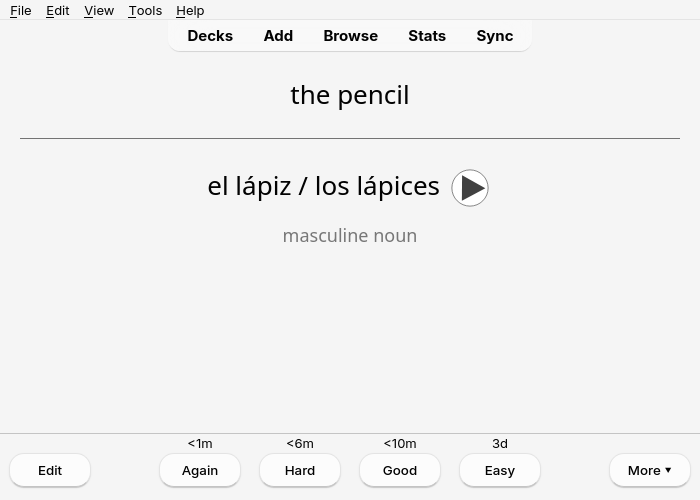

**Fill in the blanks**: the question hides the word, the answer shows it.

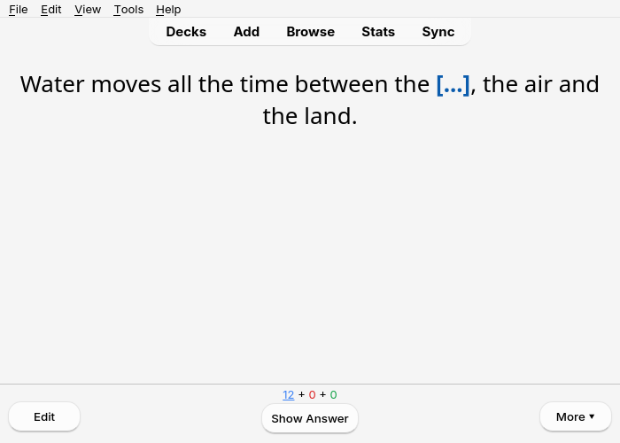

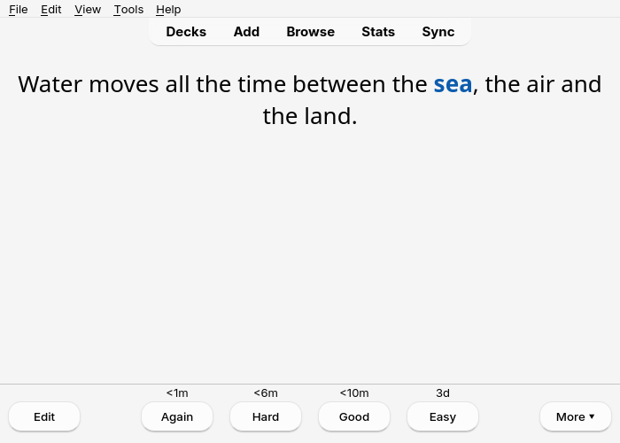

**Multiple choice**: the answer marks the right choice with ✔ and gives the explanation.

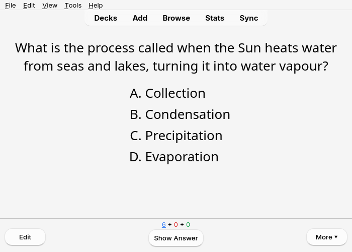

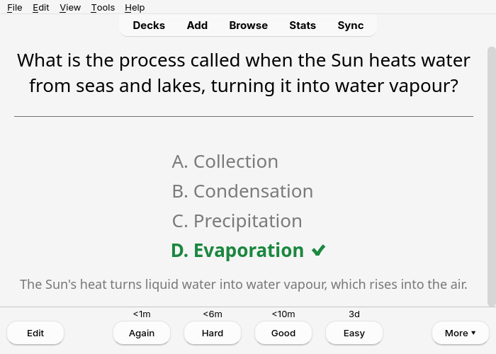

**Diagrams**: the photo of the lesson with numbered labels; one card per label to name.

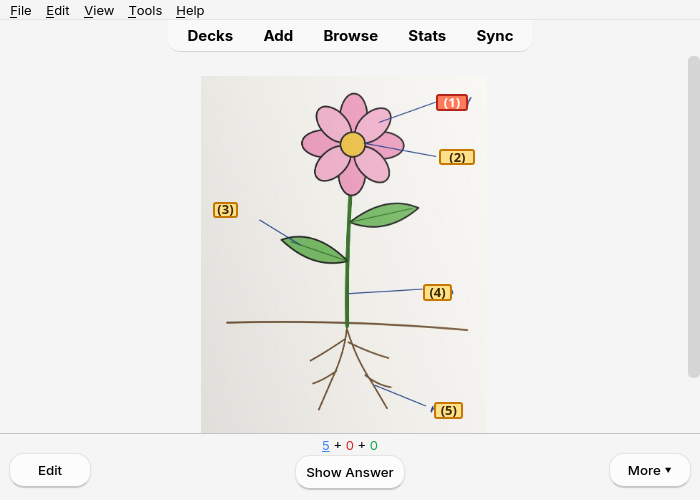

**Pictures**: a drawing to name in the language being learned, with its audio.

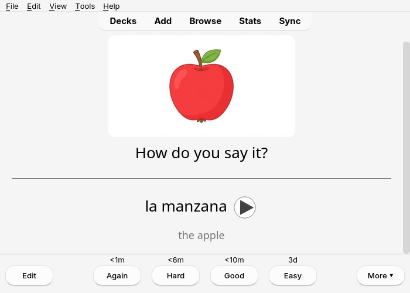

**Figures**: the figure drawn by Notosaurus comes with the question.

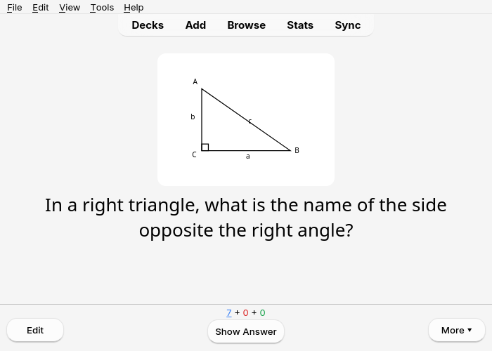
