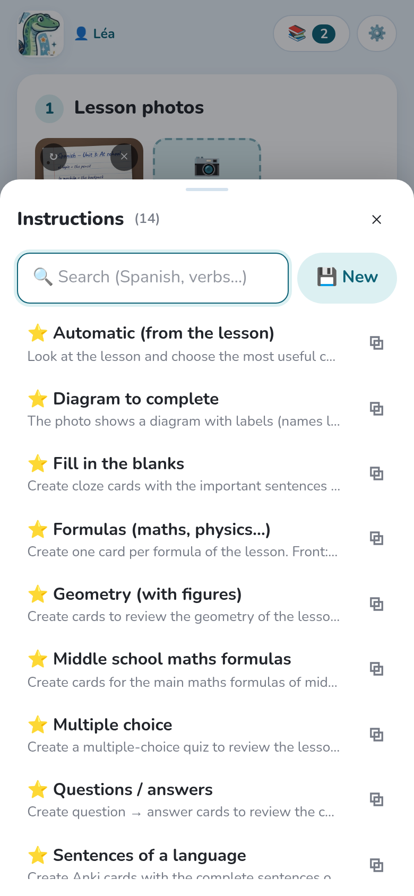
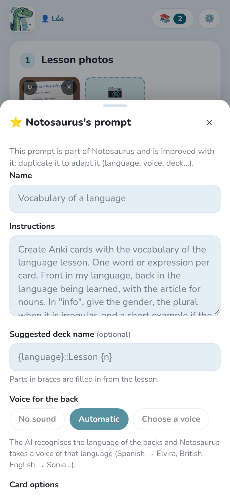

The **instructions** (or prompt) tell the AI what to make of the lesson: which cards, in which
direction, in which languages. The photo says *what* to learn; the instructions say *how*.

## Choosing instructions

Under **Instructions**, the most recent ones are shown as buttons. **All** opens the whole
list, with a search.

The text of the chosen instructions shows below the buttons. You can change it **for this
time only** (“Changed for this time only”), for instance to add “only the verbs”: your
change stays with the lesson, the saved instructions don't change.

## Notosaurus's instructions

The instructions marked ⭐ come with Notosaurus and get better with each version. They can't
be changed, but they can be **duplicated** to make your own version.

| Instructions | What they make |
|---|---|
| Automatic (from the lesson) | The AI looks at the lesson and chooses the most useful cards. |
| Vocabulary of a language | One card per word or expression, with the article, gender and plural in the info. |
| Sentences of a language | One card per sentence, in your language and the language being learnt. |
| Questions / answers | Short questions on the content: dates, definitions, key ideas. |
| Fill in the blanks | Sentences with gaps (cloze): one card per gap number. |
| Multiple choice | A question, the right answer and three plausible wrong ones. |
| True / false | Statements, half of them false with one precise mistake. |
| Formulas (maths, physics…) | One card per formula, with what each letter stands for. |
| Middle school maths formulas | The main formulas of middle school, without a photo. |
| Geometry (with figures) | Figures, properties and vocabulary, with an exact figure drawn on the cards. |
| Diagram to complete | The labels of a diagram hidden behind numbers: one card per label. |
| Words in pictures | The picture of each word on the front, drawn by an image model; the word on the back. |
| Word list (no photo) | One card per word of the list you add at the end of the instructions (English → Spanish: duplicate it for another language). |
| Spelling dictation | One card per word to spell: a sentence with the word missing on the front, the word on the back, a spelling tip. |

## Your own instructions

**New** creates instructions you will use again, for example for a language your child learns
every week. **Duplicate** starts from a Notosaurus prompt.

- **Name**: what the button shows.
- **Instructions**: what the AI must do, in plain words (“one card per date, front the event,
  back the date”).
- **Suggested deck name**: the Anki deck, with `::` for sub-decks. The parts in braces are
  filled in from the lesson: `Spanish::Lesson {n}` becomes `Spanish::Lesson 5`.
- **Voice for the back**: no sound, **Automatic** (the AI recognises the language of the backs
  and Notosaurus picks a voice of that language), or a voice you choose and can listen to.
- **Card options**: type the answer, add a dictation (see [Reviewing the cards](../review/)).

**✏️ Free** writes instructions for this time only: they stay with the lesson but aren't
added to your list. **Save as new instructions** keeps them if they worked well.

## “Did you know?” facts

The **💡 Add “Did you know?” facts** switch, under the instructions, asks the AI to add a
short, well-known fact to some cards. It shows on the back in Anki. It is off by default and
remembered on each device.

## Standing instructions

Some instructions apply to every lesson: “Spanish from Spain”, “in year 8; short answers”.
Write them once in **Settings → Instructions for the AI**, for every profile or for each
child: see [Several children](../several-children/#instructions-per-child).
