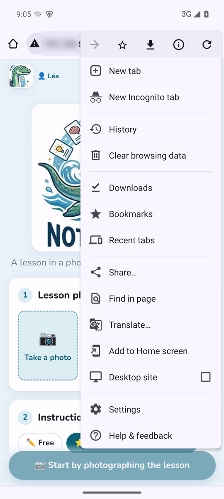
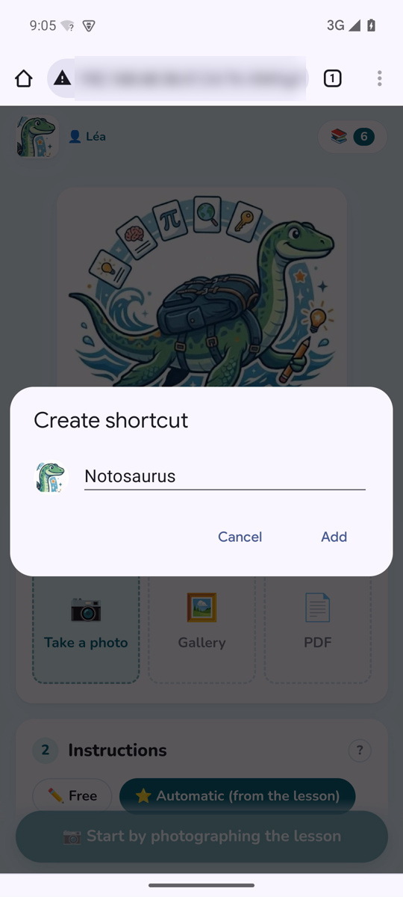
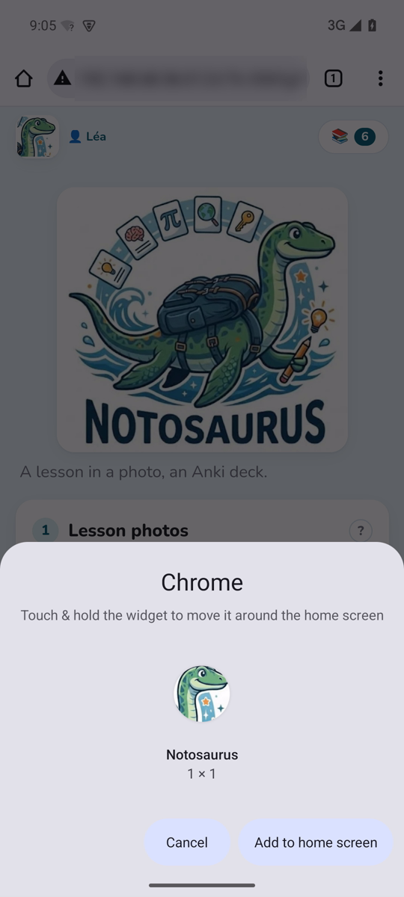
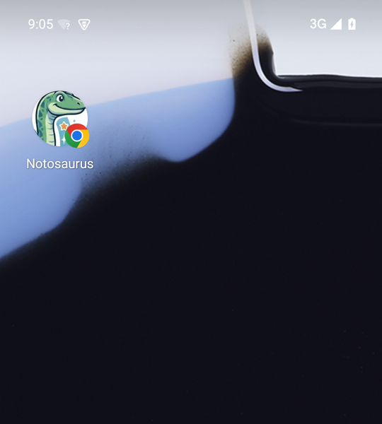

Notosaurus is a web page, not an app from a store: the phone opens it in its browser. Added to the
home screen, it then opens with one tap, like an app.

## 1. Open Notosaurus

In Anki on the computer, **Tools → Notosaurus → Open on the phone…** shows a QR code. With the phone
on the **same Wi-Fi** as the computer, scan it with the phone's camera and open the link.

Scanning the QR code also **allows that phone** to use Notosaurus: other devices on the Wi-Fi can't
(see [Privacy and security](../privacy/#who-can-use-notosaurus)).

## 2. Add it to the home screen

Do it **right after scanning the QR code**, from the page that opened: the icon keeps the phone's
authorisation.

### Android

In **Chrome**:

1. The **⋮** menu, top right → **Add to Home screen**.

   

2. **Create shortcut**: keep the name **Notosaurus**, then **Add**.

   

3. **Add to home screen** (or touch and hold the icon to place it yourself).

   

4. The **Notosaurus** icon is on the home screen, sometimes on the next page.

   

In other browsers:

- **Samsung Internet**: the **≡** menu → **Add page to** → **Home screen**.
- **Firefox**: the **⋮** menu → **Add to Home screen** (or **Install**).

### iPhone and iPad

In **Safari**: the **Share** button (the square with an arrow) → **Add to Home Screen** → **Add**.
On an iPhone, the icon doesn't share Safari's memory: adding it right after scanning the QR code is
what lets it in.

## Good to know

- **The phone must be on the same Wi-Fi** as the computer, and Anki must be open on the computer
  (with the add-on): Notosaurus works at home, not away from it.
- **If every phone was disconnected** (Settings → Phones) or the computer's address changed (after
  restarting the router), the icon no longer opens Notosaurus: scan the QR code again, then add the
  page to the home screen again (and remove the old icon).
