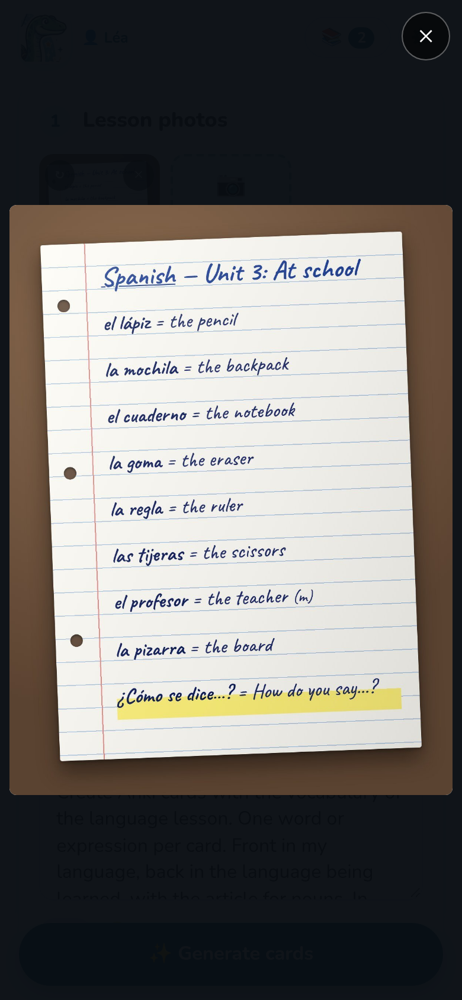

The AI reads what it sees: a clear photo gives better cards, and fewer corrections.

## Tips

- **Good light, no shadow.** Daylight near a window is best. Avoid the shadow of the phone
  and of your hand on the page.
- **The page flat, filling the photo.** Hold the phone above the page, parallel to it. A
  slight angle is fine; a strong one blurs the far side.
- **One page per photo.** For a double page, take two photos.
- **Sharp.** Tap the screen to focus before taking the photo, and keep still.
- **Only the lesson.** Leave out other pages, drawings in the margin and corrections that
  aren't part of what must be learnt, or tell the AI what to ignore in the instructions.

Handwriting is read well when it is legible to an adult. Claude reads it best; Gemini is a
good and cheaper choice.

## Several pages

A lesson can have **up to 10 pages**. After the first photo, **Next page** adds another one;
**Gallery** picks photos already taken (JPEG, PNG, WebP or GIF).

On each photo:

- **↻** turns it a quarter turn;
- **×** removes it;
- a tap shows it full screen: swipe between pages, tap again to see it at its real size.

You don't need to turn sideways photos yourself: Notosaurus finds how each page is turned
when it reads it, and saves it upright.

## What happens to the photos

- The photos are sent to the **AI service chosen in the settings**, to read them, and to
  nobody else.
- They are **saved with the lesson** on your computer, so that you can reopen it, correct
  it or generate it again later. Deleting the lesson deletes them.
- Diagram cards keep a **cropped copy** of the diagram, with its labels hidden: that's what
  Anki shows.

## No photo?

Without a photo, **Generate from the prompt alone** creates the cards from the instructions:
put the words in them (“the 20 irregular verbs: be, have, go…”), or ask for a topic (“the
planets of the solar system”). Check those cards carefully: they don't come from your
lesson.
