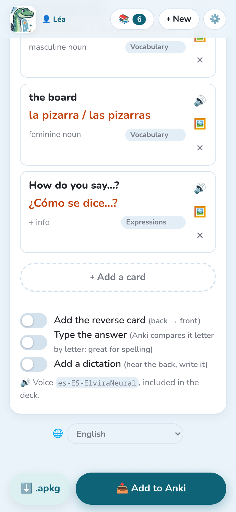

Even the best AI misreads a word now and then: **always look through the cards** before
sending them. Everything you change is saved as you go (“✓ Saved”).

## The deck and the cards

- **Deck**: the name of the Anki deck. `::` makes sub-decks: `Spanish::Unit 3 - At school`.
- Each card has a **front** (the question) and a **back** (the answer). Tap a text to change
  it.
- **+ info** adds a note shown under the answer: gender, plural, an example…
- **sub-deck** puts the card in a sub-deck of the lesson (“Vocabulary”, “Verbs”).
- **🔊** plays the back with the lesson's voice.
- **×** deletes the card; **＋ Add a card**, at the bottom, adds one.

**📝 Instructions used for this lesson**, above the cards, reminds what the AI was asked.

## Correcting with the AI

Instead of changing the cards one by one, ask in plain words, in the field above the cards:

- “remove the card about the father”
- “you forgot the colours at the bottom of the page”
- “add the plural on the back, like: la regla / las reglas”
- “shorter questions”

Tap **Correct**. The AI sees the photos again and changes only what you asked: changed cards
are marked **changed**, new ones **new**, and a sentence sums up what it did. **↩ Undo** brings
the cards back as they were.

## Explaining a card

**💬** on a card asks the AI to explain it: what it means, and why its answer is the answer, in
two to four sentences, at a pupil's level, in the page's language. Handy for a subject you've
forgotten, or a card the pupil doesn't understand.

Under the explanation, the AI offers only what would help with **that** card:

- **An example**: a sentence using the word, a worked calculation with the formula;
- **A way to remember it**: when a natural one exists;
- **Why is it right?**: when it isn't obvious, and for a multiple choice or a true/false card
  (why the other options are wrong too).

**Keep in “Info”** adds what was explained to the card's info: you'll find it on the back in
Anki. Each explanation is a short AI call (a fraction of a cent with Gemini Flash, about a cent
with Claude Sonnet), counted with the lesson's costs.

## Generating again

**✨ Generate again**, under the instructions, makes the cards of the open lesson again, for
instance with other instructions or after adding a page. It replaces the cards; **↩ Undo**
brings them back, unless the photos changed. If the lesson was already sent to Anki, the cards sent stay there, and the new ones
are added at the next send.

## Card options

At the bottom of the lesson:

- **Add the reverse card**: Anki also asks back → front.
- **Type the answer**: Anki compares what is typed letter by letter. Great for spelling.
- **Add a dictation**: a card where the back is heard, then written. It needs a voice.

The line below says which voice reads the backs. It is included in the deck, so it plays
everywhere, even offline.

## A lesson of another profile

A lesson shared by another child's profile opens **read only**: you can still add it to your
own Anki, but only its owner can change it. See [Several children](../several-children/).
