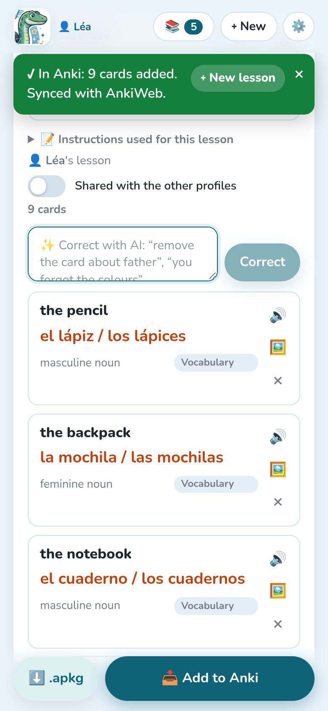

Once the cards are checked, they go to Anki in one tap, or as a file.

## Add to Anki

**📥 Add to Anki** writes the cards straight into the **profile open in Anki**, in the lesson's
deck, with their audio and pictures. A message says what was done, for instance “✓ In Anki:
9 cards added. Synced with AnkiWeb.”

- With the **add-on**, Notosaurus writes into Anki itself: nothing else to install.
- Notosaurus **standalone** (without the add-on) needs Anki desktop open with the
  [AnkiConnect](https://ankiweb.net/shared/info/2055492159) add-on.
- If the lesson belongs to another child than the profile open in Anki, Notosaurus asks before
  writing it into the wrong collection (see [Several children](../several-children/)).

## Sending a lesson again

You can correct a lesson and send it again as many times as you like: its cards are
**updated** in Anki, **not duplicated**, and the review history of each card is kept. Cards
added since the last send are added; cards deleted from the lesson stay in Anki (delete them
there if you want). Deleting a whole lesson in Notosaurus offers to delete its cards in Anki
too, with their review history.

Changing a card option (reverse card, type the answer…) on a lesson already sent moves its
cards to the matching note type, history kept.

In Anki, each lesson's notes carry a tag `notosaurus::<lesson>`: handy to find them in the
browser.

## The .apkg file

**⬇️ .apkg** downloads the deck as a file, with its audio and pictures, without needing Anki to
be open:

- **on a computer**, double-click it: Anki imports it;
- **on Android**, open the downloaded file and choose **AnkiDroid**. If AnkiDroid isn't
  offered, share the file to AnkiDroid, or use **Import** in AnkiDroid's menu;
- **on an iPhone**, open it with **AnkiMobile** from the share menu.

Importing a newer `.apkg` of the same lesson also updates its cards instead of duplicating
them.

## Getting the cards to the phone

After **Add to Anki**, Notosaurus **syncs the profile with AnkiWeb** (the option **Sync with
AnkiWeb after sending**, in the settings). The cards then reach AnkiDroid or AnkiMobile at
their next sync. If the profile isn't logged in to AnkiWeb, the cards are added to Anki on the
computer, and the message says that it wasn't synced.

Without an AnkiWeb account, the `.apkg` file opened on the phone puts the deck straight into
AnkiDroid, but the reviews then stay on that phone only.
