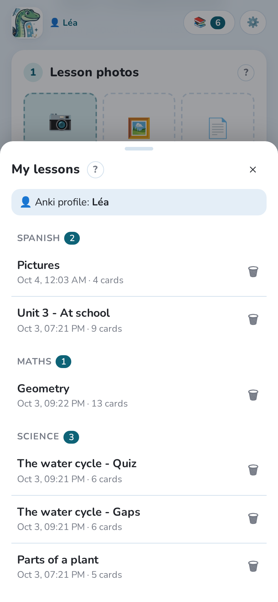
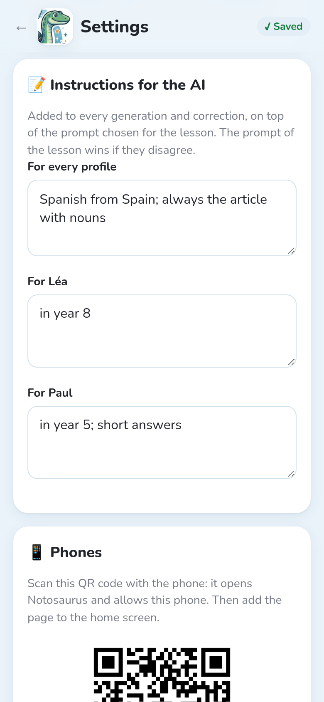

Each child gets their own **Anki profile**: their own cards, their own progress. Notosaurus
follows the profile open in Anki.

## Set up one profile per child

1. In Anki, **File → Switch Profile → Add**, and create a profile per child (Léa, Paul…).
2. For each profile, create an **AnkiWeb account** and log in to it in that profile
   (**Tools → Preferences → Syncing**). One AnkiWeb account holds one collection, so each
   child needs their own.
3. On each child's phone, log in to **AnkiDroid** or **AnkiMobile** with that child's
   AnkiWeb account.

:::tip[No mailbox per child]
Many e-mail services accept aliases with a `+`: `parent+lea@example.com` and
`parent+paul@example.com` arrive in your own mailbox, but count as two addresses.
:::

## Lessons belong to a profile

- A lesson belongs to the profile **open in Anki when it is created**. The list of lessons
  shows that profile's lessons.
- To make a lesson for Paul, **open Paul's profile in Anki first**, then take the photo.
- If you send a lesson while another child's profile is open, Notosaurus warns you before
  writing it into the wrong collection.
- A lesson can be **shared with the other profiles** (the switch in the review), for
  instance when two children have the same lesson.

## Instructions per child

In **Settings → Instructions for the AI**, you can add instructions for every profile
(“Spanish from Spain”) and for each child (“in year 8; short answers”). They are added to
every lesson of that child.

## Getting the cards to the phone

After **Add to Anki**, Notosaurus syncs the open profile with AnkiWeb. The cards reach the
child's phone at its next sync.
