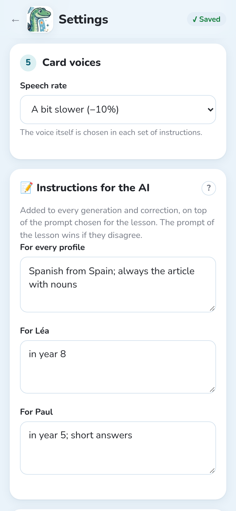

Notosaurus can read the back of each card aloud: handy for languages, to hear the right
pronunciation. The audio is **included in the deck**, so it plays in Anki everywhere, on the
computer and the phone, even offline.

## Choosing the voice

The voice is part of the **instructions** (see [Instructions](../instructions/)): open them
with **✏️ Edit instructions**, or **Duplicate** a Notosaurus prompt, then choose under **Voice for
the back**:

- **No sound**: the backs aren't read aloud.
- **Automatic**: the AI recognises the language of the backs, and Notosaurus takes a voice of
  that language (Spanish → Elvira, British English → Sonia…). The simplest choice.
- **Choose a voice**: type the start of the language (`fr-FR`, `es-ES`, `en-GB`…) to see its
  voices, female or male, and **▶** to listen to one.

The Notosaurus vocabulary instructions use **Automatic**. At the bottom of a lesson, a line says
which voice reads its backs.

## Listening

In the review, **🔊** on a card plays its back with the lesson's voice: check the pronunciation
before sending the cards.

## Speed

**Settings → Card voices → Speech rate**: **Normal**, **A bit slower (−10 %)** (the default) or
**Slow (−25 %)**, handy for beginners. The speed applies to the audio made from then on.

## Dictation

With a voice, the **Add a dictation** option (at the bottom of the lesson, or in the
instructions) adds a card where the back is heard, then written. See
[Reviewing the cards](../review/#card-options).

## Cards without sound

The voices come from Microsoft's text-to-speech service, so making the audio needs the Internet.
If it doesn't answer, the cards are sent without sound and the message says how many. Send the
lesson again later: the missing audio is added. See
[Privacy and security](../privacy/) for what is sent.
